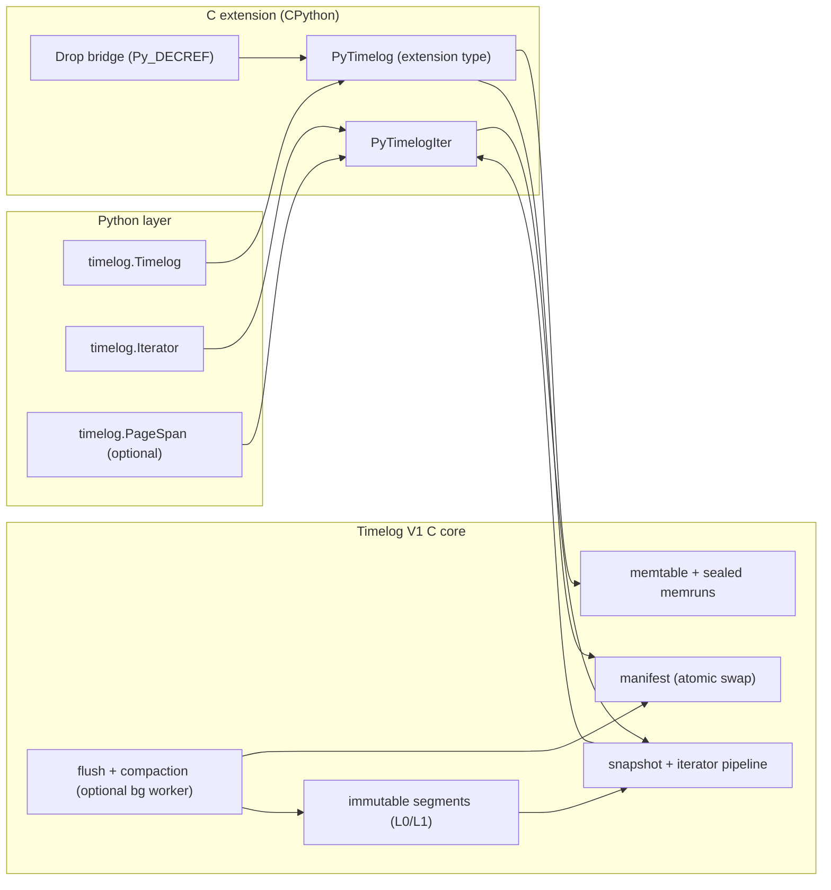
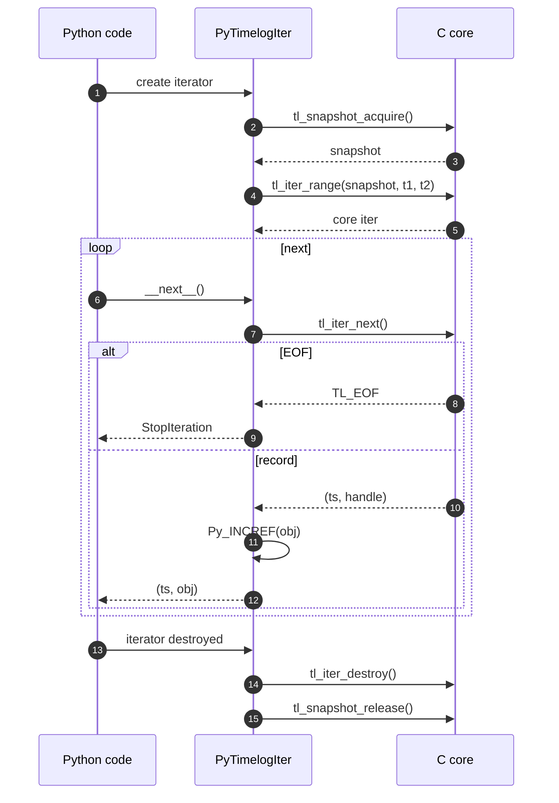

# Timelog V1 (Python Object Mode)
## North‑Star High‑Level Design

**Status:** Draft (V1 target)  
**Audience:** Timelog maintainers, Python/C extension engineers, performance and infra engineers  
**Scope:** This document specifies the end‑to‑end design of **Timelog as a Python library** backed by the existing **Timelog V1 C engine**. It is the shared contract for semantics, architecture boundaries, lifetimes, concurrency, and performance principles.

Timelog is not a time‑series analytics engine. It is an always‑on, in‑memory **time index** that makes **time slicing** and **time eviction** cheap enough to stop thinking about them.

---

## 1. The mental model

A Timelog instance is a time‑sorted multimap:

- key: `ts : int64` (caller‑chosen unit: s/ms/us/ns)
- value: an opaque payload **handle**

In Python‑object mode, the handle represents a **reference to a CPython object**. Timelog does not interpret payloads. It is responsible for ordering, range selection, tombstone filtering, and eventual reclamation.

The workload model this design optimizes for is narrow and intentional:

- inserts are frequent and mostly in timestamp order, but not perfectly ordered
- reads are mostly time‑range scans
- deletes are mostly time‑range retention (“drop everything older than T”)

The core design principle is: **make hot paths predictable**.
Writes are append‑like. Reads are binary searches + linear scans over contiguous memory. Deletes are metadata until compaction.

---

## 2. Goals and non‑goals

### 2.1 Goals

The Python library must support:

1. **Append**: insert `(ts, obj)` efficiently, including mildly out‑of‑order inserts.
2. **Range reads**: iterate records in `[t1, t2)` (half‑open) with predictable latency.
3. **Retention deletes**: `delete_before(cutoff)` and `delete_range(t1, t2)` as fast logical deletes.
4. **Snapshot‑consistent iteration**: iterators read from a stable view even as writes continue.
5. **Pythonic ergonomics**: slicing, iterators, context managers, simple error model.
6. **Zero‑copy where meaningful**:
   - zero‑copy object access (return the exact stored objects)
   - zero‑copy timestamp access per contiguous page span via `memoryview`
7. **Correct object lifetimes**: no use‑after‑free; no refcount leaks; safe with background threads.
8. **Operational control**: manual vs background maintenance, backpressure visibility.

### 2.2 Non‑goals (V1)

- no persistence / WAL / crash recovery
- no stable row IDs; duplicates are preserved; tie order among equal timestamps is unspecified
- no general “vectorized analytics” on payloads
- no promise that Python objects are physically colocated in memory (CPython objects are not movable)

---

## 3. Architecture at a glance

Timelog is a layered system:

- **C core (Timelog V1 engine)**: immutable pages/segments/manifests, tombstones, snapshots, iterators, maintenance.
- **Python binding layer**: CPython extension that maps Python semantics onto the C engine, and manages CPython object lifetimes.
- **Python API**: ergonomic classes and functions.



The crucial boundary: **the C core never calls Python except via an explicit, tiny “drop callback” bridge**.

---

## 4. Semantics and invariants

This section is what engineers and agents should treat as immovable until V2.

### 4.1 Timestamp domain and ranges

Timestamps are full‑range signed `int64`. There are no sentinel timestamp values. Unboundedness is represented explicitly (flags), not by special timestamps.

All ranges are half‑open:

- `[t1, t2)` includes `t1`
- excludes `t2`
- bounded empty range when `t1 >= t2`

### 4.2 Duplicates and ordering

- duplicates at the same timestamp are allowed and preserved
- query output is **non‑decreasing by timestamp**
- ordering among equal timestamps is unspecified in V1

This affects pagination and stable cursors. If callers need stable ordering among duplicates, they must encode an additional ordering key into the payload (or use a structured handle indirection).

### 4.3 Delete semantics

Deletes are time‑range tombstones. They become visible at snapshot boundaries and are applied during reads.

Logical delete is fast. Physical reclamation is deferred to compaction and close.

### 4.4 Snapshot semantics

Every read runs against a snapshot:

- a pinned manifest
- a pinned memtable view

A snapshot is immutable, and iterators are bound to snapshot lifetime. Publishing a new manifest must never invalidate an in‑flight snapshot.

### 4.5 Complexity envelope (guidance)

This is not a formal proof, but it captures what V1 must preserve:

- append (mostly ordered): amortized O(1)
- append (out‑of‑order within bounded budget): O(log M) or O(M) with M bounded by config
- range query: O(log catalogs + output) plus an O(output · log K) merge factor where K is number of sources (bounded by L0/L1 limits)
- delete_range / delete_before: O(log T) or O(T) with T the tombstone interval count (kept coalesced)
- compaction: O(N log K) merge over selected inputs; expensive by design but off the hot write path

---

## 5. Core engine contract (assumed by Python layer)

The Python library depends on a few core behaviors remaining true:

- immutable segments/pages after publish
- atomic manifest publication (no half‑states)
- background maintenance never holds publication locks during heavy build work
- physical drops occur only when records are no longer reachable by any pinned snapshot

The Python layer does not re‑implement these; it treats them as the C engine’s correctness boundary.

---

## 6. Concurrency model and publication

### 6.1 Threading contract

- externally: single writer, multiple readers
- internally: optional maintenance thread

The Python binding effectively serializes writes under the GIL, which satisfies the “single writer” requirement without extra Python‑level locks.

### 6.2 Publication: snapshot acquisition vs manifest swap

A snapshot must capture a consistent pair:

- (manifest pointer)
- (memtable view)

The core engine uses a seqlock‑style protocol around publication. At a high level:

```c
while (true) {
    lock(writer_mu);
      seq1 = view_seq;           // must be even
      manifest = acquire(manifest_ptr);
      memview = capture_memview();
      seq2 = view_seq;
    unlock(writer_mu);

    if (seq1 == seq2 && is_even(seq1)) break;
    release(manifest); destroy(memview);
}
```

From the Python layer, the important point is: acquiring a snapshot is safe, bounded, and does not block on long‑running compaction work.

### 6.3 GIL and background threads

If maintenance is enabled in background mode, the C engine may invoke the drop callback on a non‑Python thread. Any Python C‑API usage in callbacks must acquire the GIL.

The binding must treat “drop callback runs on any thread” as the default assumption.

---

## 7. Python object mode: handle representation and lifetime

### 7.1 Handle encoding

In Python‑object mode:

- `handle` stores a `PyObject*` as an integer (`uint64_t`)

This is only correct if `sizeof(void*) <= sizeof(uint64_t)`. Enforce this at compile time:

```c
_Static_assert(sizeof(void*) <= sizeof(uint64_t), "Timelog handle cannot hold PyObject*");
```

The core engine treats the handle as opaque. Only the binding layer converts between `PyObject*` and `uint64_t`.

### 7.2 Ownership model

Timelog must hold a strong reference to each inserted Python object until the record is physically reclaimed.

Define ownership as:

- On **append(ts, obj)**: the Timelog instance takes one owned reference (INCREF).
- On **physical drop** (during compaction or close): that owned reference is released (DECREF).

Logical deletes via tombstones do not immediately release Python objects. The release happens when tombstoned records are physically omitted during compaction, or when the Timelog is closed.

### 7.3 The on‑drop callback bridge

Install a core `on_drop_handle` callback that safely decrements Python references:

```c
static void tl_py_on_drop(void* ctx, tl_ts_t ts, tl_handle_t h) {
    PyGILState_STATE g = PyGILState_Ensure();
    PyObject* obj = (PyObject*)(uintptr_t)h;
    Py_DECREF(obj);
    PyGILState_Release(g);
}
```

Constraints:

- must be fast; must not call back into Timelog
- must be correct even when invoked from non‑Python threads

### 7.4 Iterator handoff semantics

When an iterator returns an object to user code, the binding returns it with a fresh INCREF. This ensures:

- user code can keep the object after the iterator advances
- the object remains valid even if a later compaction drops the record

---

## 8. Python API (public surface)

### 8.1 Primary types

`timelog.Timelog`  
The main container. Owns the C engine instance.

`timelog.Iterator`  
A snapshot‑bound iterator over a time range.

Optional (recommended for zero‑copy timestamps + batching):
`timelog.PageSpan`  
Exposes contiguous timestamp memoryviews and amortized object extraction for a single page slice.

### 8.2 Suggested API

```python
class Timelog:
    def __init__(self, *, time_unit="ms", maintenance="manual", **tuning): ...
    def close(self) -> None: ...

    def append(self, ts: int, obj: object) -> None: ...
    def extend(self, items: "Iterable[tuple[int, object]]", *, mostly_in_order: bool = True) -> None: ...

    def delete_range(self, t1: int, t2: int) -> None: ...
    def delete_before(self, cutoff: int) -> None: ...

    def flush(self) -> None: ...
    def compact(self) -> None: ...

    def range(self, t1: int, t2: int) -> "Iterator": ...
    def since(self, t1: int) -> "Iterator": ...
    def until(self, t2: int) -> "Iterator": ...

    def __getitem__(self, s: slice) -> "Iterator": ...
    def __iter__(self) -> "Iterator": ...
```

Slicing maps naturally to time windows:

- `log[t1:t2]` → iterator over `[t1, t2)`
- `log[t1:]` → iterator over `[t1, +inf)`
- `log[:t2]` → iterator over `[-inf, t2)`

Direct `log[t]` indexing is intentionally omitted in V1 because duplicates exist. If needed, provide `at(ts)` returning an iterator.

Range edge cases:
- `range(t1, t2)` returns an empty iterator when `t1 >= t2` (mirrors core semantics; not a ValueError).

### 8.3 Iterator yield shape

The default iterator yields `(ts, obj)`.

For performance, also support batching via `next_batch(max_items)` returning `(ts_list, obj_list)`.

---

## 9. Binding layer (CPython extension) design

### 9.1 Object layout

`PyTimelog` contains:

- pointer to `tl_timelog_t`
- config snapshot (for introspection)
- maintenance state
- an “open iterators” counter (debug and safe close)

`PyTimelogIter` contains:

- pinned `tl_snapshot_t*`
- `tl_iter_t*`
- borrowed ref to parent `PyTimelog`
- range bounds (for repr/debug)

### 9.2 Append path (Python → C)

```c
PyObject* Timelog_append(PyTimelog* self, PyObject* args) {
    long long ts = ...;         // parse PyLong
    PyObject* obj = ...;        // parse object

    Py_INCREF(obj);             // Timelog owns one ref
    tl_handle_t h = (tl_handle_t)(uintptr_t)obj;

    tl_status_t st = tl_append(self->tl, (tl_ts_t)ts, h);
    if (st != TL_OK) {
        Py_DECREF(obj);         // rollback on failure
        return translate_error(st);
    }
    Py_RETURN_NONE;
}
```

Batch append must preserve atomicity at the Python level. Prefer a conservative approach:

- validate and INCREF all objects first
- call core batch
- if core reports failure, DECREF all pinned objects (rollback)

If the core cannot guarantee all‑or‑nothing insert, implement batch as a loop and stop on first error.

### 9.3 Read path (snapshot + iterator)

On iterator creation:

1. acquire snapshot
2. create core iterator for range
3. bind both to the Python iterator object

On `__next__`:

```c
tl_record_t rec;
tl_status_t st = tl_iter_next(it->core_it, &rec);
if (st == TL_EOF) raise StopIteration;
if (st != TL_OK) raise error;

PyObject* obj = (PyObject*)(uintptr_t)rec.handle;
Py_INCREF(obj);  // caller owns
return make_tuple_2(ts_as_pyint(rec.ts), obj);
```

### 9.4 Maintenance controls

Expose both modes:

- **manual**: `flush()` and `compact()` are explicit
- **background**: start worker on open; stop on close

For long operations (flush/compaction), release the GIL around pure C work:

```c
Py_BEGIN_ALLOW_THREADS
st = tl_compact(self->tl);
Py_END_ALLOW_THREADS
```

---

## 10. Zero‑copy views and batch execution

“Zero‑copy” is not a single feature; it is a spectrum.

- object mode already returns the same objects (no serialization/copy)
- timestamps can be exposed as a `memoryview` only when contiguous

### 10.1 PageSpan API (recommended)

Expose a page‑level iterator that yields contiguous spans:

```python
for span in log.page_spans(t1, t2):
    ts_view = span.timestamps  # memoryview of int64 timestamps (read-only)
    objs = span.objects()      # tuple/list of objects matching those timestamps
```

`span.timestamps` references underlying page memory; therefore `span` must pin the snapshot.

This enables efficient downstream conversion:

```python
arr = np.frombuffer(span.timestamps, dtype=np.int64)   # zero-copy timestamps
```

### 10.2 Iterator.next_batch(n)

`next_batch` amortizes Python overhead by returning many records per call:

```python
ts_list, obj_list = it.next_batch(4096)
```

This often outperforms per‑item iteration in Python loops by reducing interpreter overhead and tuple allocations.

---

## 11. Payload locality: what is possible and what is not

CPython objects are not movable. You cannot take arbitrary Python objects and repack them contiguously after creation.

What we can do reliably:

- keep handle arrays dense and contiguous (already true)
- design the API to encourage mostly‑in‑order ingestion, which tends to cluster allocations
- offer optional payload strategies for true contiguity (future‑proofing)

### 11.1 Optional payload modes (future)

1. **Object‑handle mode (default):** store `PyObject*`, INCREF/DECREF around physical lifetime.
2. **Bytes mode:** store payload bytes in Timelog‑managed slabs; return `memoryview` directly.
3. **Struct mode:** store native structs in slabs; expose lightweight Python wrappers pointing into slabs.

The core stays payload‑agnostic; only the binding changes.

---

## 12. Error model

Translate core status codes to Python exceptions consistently:

- invalid arguments → `ValueError` (excluding `t1 >= t2` for range iterators, which yields empty)
- overflow → `OverflowError`
- out of memory → `MemoryError`
- busy/backpressure → `TimelogBusyError` (custom, retryable)
- state errors (not open, wrong maintenance mode) → `TimelogError`
- internal errors → `SystemError` (or `TimelogError` if you want a single domain exception)

Make failures atomic at the Python level:
- if `append` fails, Timelog must not keep a leaked reference (rollback DECREF)
- if iterator creation fails, release snapshot/iter resources

---

## 13. Packaging and build system

Ship as a normal Python package with wheels.

Recommended build stack:

- `pyproject.toml` + `scikit-build-core` (CMake‑driven) for portable wheels
- compile the existing C core as part of the extension build
- enable `-O3`, LTO where safe; sanitizers in CI builds

The wheel should contain one extension module `_timelog` plus a thin Python wrapper package `timelog/`.

---

## 14. Testing and verification strategy

Correctness depends on three interacting lifetimes: segments/manifests, snapshots/iterators, and Python objects.

Testing must cover:

- refcount correctness (no leaks, no double DECREF)
- snapshot isolation: old iterators see old data even after deletes/compaction, but never crash
- delete semantics: tombstones hide records immediately for new snapshots; compaction eventually drops and triggers DECREF
- background maintenance: drop callbacks from non‑Python threads still safely DECREF via GIL state API
- stress: append + range scan + delete_before loops; random OOO inserts; repeated flush/compact cycles

CI should run ASan/UBSan for the C core tests and Python extension tests.

---

## 15. Critical sequences (pseudocode + diagrams)

### 15.1 Append → delete → compact (object reclamation)

```mermaid
sequenceDiagram
  autonumber
  participant P as Python code
  participant X as C extension
  participant C as C core

  P->>X: append(ts, obj)
  X->>X: Py_INCREF(obj)
  X->>C: tl_append(ts, (handle) obj)
  C-->>X: TL_OK
  X-->>P: return None

  P->>X: delete_before(cutoff)
  X->>C: tl_delete_before(cutoff)
  C-->>X: TL_OK
  X-->>P: return None

  P->>X: compact()
  X->>C: tl_compact()
  C->>X: on_drop(ts, handle) for reclaimed records
  X->>X: PyGILState_Ensure(); Py_DECREF(obj); PyGILState_Release()
  C-->>X: TL_OK
  X-->>P: return None
```

### 15.2 Iterator lifetime



---

## 16. Design checkpoints

This is the “north‑star checklist”. If later changes violate these, the system becomes harder to reason about.

1. Half‑open ranges everywhere (`[t1, t2)`).
2. No timestamp sentinels; unboundedness is explicit.
3. Immutable storage objects after publication.
4. Snapshot isolation for reads.
5. Python objects are pinned with INCREF on insert and released with DECREF only on physical drop.
6. Background threads never call Python without acquiring the GIL.
7. The binding layer owns CPython semantics; the C core remains payload‑agnostic.

---

## Appendix A: glossary (short)

**Handle:** Opaque `uint64` payload token stored with each timestamp.  
**Tombstone:** Time interval marking records as logically deleted.  
**Flush:** Convert a sealed memrun into an immutable L0 segment.  
**Compaction:** Merge L0 segments (and overlapping L1) into non‑overlapping L1 output; fold tombstones; reclaim drops.  
**Snapshot:** A pinned view (manifest + memtable view) used by iterators.
