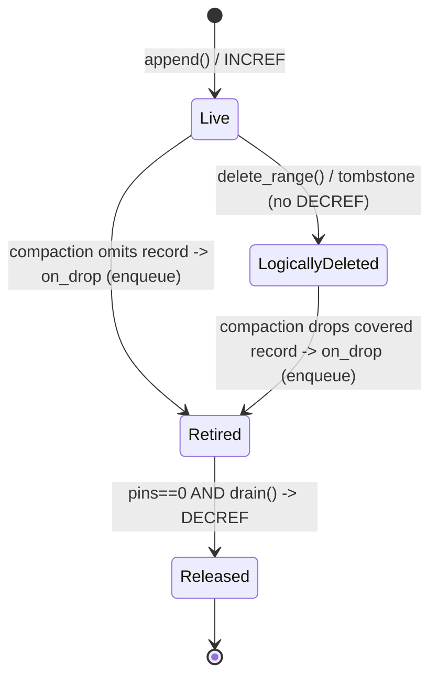

# LLD-B1: Python Object Handle & Lifetime Subsystem (Layer B / Part 1)

Version: 0.1 (implementation draft)  
Last updated: 2026-01-11

This LLD defines how Timelog stores CPython objects as `tl_handle_t` values while remaining fully payload-agnostic in the C core. It is the “correctness kernel” of the Python integration: reference ownership, snapshot safety, and thread/GIL rules live here.

---

## 1. Scope and non-goals

Scope:

Timelog’s core stores records as `(ts:int64, handle:uint64)` and treats the `handle` as an opaque token. In “Python-object mode”, the handle encodes a `PyObject*`. This LLD specifies:

1) handle encoding/decoding rules  
2) refcount ownership rules (`INCREF` / `DECREF`) across append, iteration, deletion, compaction, and close  
3) how to handle Timelog’s snapshot isolation when a record is retired (dropped from the newest manifest) while older snapshots may still reference it  
4) thread-safety rules for drop events that may originate from background maintenance threads

Non-goals:

This document does **not** design the user-facing Python API (slicing sugar, typing, etc.), the iterator type, the PageSpan/buffer protocol, build/packaging, or performance tuning of compaction itself. Those are separate LLDs.

---

## 2. Background and constraints

### 2.1 Timelog core constraints we must respect

Timelog V1 core exposes:

- `tl_handle_t` as an opaque 64-bit token (payload-agnostic).
- `tl_snapshot_t` as a consistent view that may outlive compaction and manifest swaps.
- `tl_on_drop_fn` callback to notify that records have been physically removed from the newest manifest after a compaction publish.

Critically, the Timelog core documents that the on-drop callback is a **retirement notification**, not a “safe to free immediately” signal: records removed from the newest manifest may still be visible to older snapshots until those snapshots are released. Therefore, a Python integration must not free or invalidate a payload that could still be returned by an older snapshot.

### 2.2 CPython constraints we must respect

- CPython object lifetime is governed by reference counts.
- `Py_DECREF()` can run arbitrary finalization code (via `tp_dealloc` / `__del__`), which can re-enter Python and call arbitrary user logic.
- Python C API calls must be made with a valid thread state and under the correct interpreter’s rules (in regular CPython builds: with the GIL held).

This subsystem is designed to be correct under CPython’s reference counting model without requiring object relocation or any “dense heap” requirement.

---

## 3. Design overview: “pin → retire → quiesce → release”

The mental model is:

1) **Pin on insert**: each appended record adds *one* engine-owned strong reference to the object (`INCREF`).  
2) **Retire on physical drop**: when Timelog reports a record was removed from the newest manifest, we mark its object reference as “retired”, but do not immediately `DECREF` if older snapshots might still yield it.  
3) **Quiescent point**: only when no binding-level snapshots are active do we actually execute the `DECREF` operations.  
4) **Yield semantics**: when an iterator yields an object to user code, it yields a *fresh new reference* (`Py_NewRef` / `INCREF`), so the user owns a safe reference independent of Timelog’s internal lifetimes.

This design is intentionally conservative: it trades some delayed reclamation for correctness and predictable semantics.

---

## 4. Correctness invariants

The implementation MUST satisfy these invariants:

I1. **Handle round-trip**  
For any stored object `o`, `decode(encode(o)) == o`.

I2. **Engine-owned reference is balanced**  
For every record successfully appended: exactly one `INCREF` is performed, and exactly one matching `DECREF` is eventually performed when the record becomes unreachable from all snapshots (or when the timelog is closed and all snapshots are released).

I3. **No use-after-free across snapshot isolation**  
A record that is still reachable through any active snapshot must never have its underlying `PyObject*` freed as a result of Timelog’s reclamation path.

I4. **No Python C-API usage in Timelog on-drop callback**  
The on-drop callback must be safe to run on any thread and must not call back into Timelog. It should avoid Python C-API calls entirely to avoid GIL contention and unexpected finalizers on background threads.

I5. **Iterator handoff uses new references**  
Objects returned to user code must be “new references” according to CPython conventions.

---

## 5. Public internal interface (within the CPython binding)

This subsystem should be implemented as a small internal module, e.g.:

- `python/src/py_handle.h`
- `python/src/py_handle.c`

The interface is used by `PyTimelog`, `PyTimelogIter`, and any “span” objects that pin snapshots.

### 5.1 Types

```c
// py_handle.h

typedef struct tl_py_handle_ctx tl_py_handle_ctx_t;

// Node for deferred Py_DECREF operations (MPSC -> single consumer drain).
typedef struct tl_py_drop_node {
    struct tl_py_drop_node* next;
    PyObject* obj;
    tl_ts_t ts;              // optional: for debugging/metrics
} tl_py_drop_node_t;
```

### 5.2 Core functions

```c
// Create/destroy the per-timelog handle context.
tl_py_handle_ctx_t* tl_py_handle_ctx_new(void);
void tl_py_handle_ctx_free(tl_py_handle_ctx_t* ctx);

// Encode/decode handle.
static inline tl_handle_t tl_py_handle_encode(PyObject* obj);
static inline PyObject*   tl_py_handle_decode(tl_handle_t h);

// Pin/unpin protocol.
static inline void tl_py_pin_on_insert(PyObject* obj);   // Py_INCREF(obj)
static inline PyObject* tl_py_user_handoff(PyObject* obj); // returns a new ref (Py_NewRef)

// Snapshot/iterator pin tracking.
void tl_py_pins_enter(tl_py_handle_ctx_t* ctx);
void tl_py_pins_exit_and_maybe_drain(tl_py_handle_ctx_t* ctx);

// Timelog drop callback (registered as tl_config_t.on_drop_handle).
void tl_py_on_drop_handle(void* on_drop_ctx, tl_ts_t ts, tl_handle_t handle);

// Drain retired objects (MUST be called with GIL held).
void tl_py_drain_retired(tl_py_handle_ctx_t* ctx, int force);
```

Notes:

- `force` is used by `close()` and destructor paths to drain even if the caller believes there are no active pins (it is still gated on pin-count correctness, see §7.2).

---

## 6. Data structures and thread model

### 6.1 Context structure

```c
// py_handle.c

struct tl_py_handle_ctx {
    _Atomic(tl_py_drop_node_t*) retired_head;  // lock-free stack of deferred decrefs
    _Atomic(uint64_t) pins;                    // number of active binding-level pins

    // Optional tuning knobs:
    uint32_t drain_max_per_call;               // 0 == drain all
    uint64_t retired_count_total;              // metrics
};
```

Key decisions:

- The on-drop callback is “many producers” (maintenance thread(s) + possible explicit compaction) and there is exactly one consumer at a time (a Python thread calling `drain` while holding the GIL). A lock-free stack is sufficient.
- The callback **does not acquire the GIL** and does **not** call `Py_DECREF`. This avoids per-record GIL overhead and avoids running Python finalizers on the maintenance thread.

### 6.2 What is a “pin”?

A “pin” is any binding object that holds a `tl_snapshot_t*` alive, such that old manifests/segments may remain reachable:

- `PyTimelogIter` (range iterator)
- `PageSpan` or any “span” object (if it keeps a snapshot pinned)
- Any future snapshot-like object exposed to Python (if you expose snapshots explicitly)

We treat pins coarsely: while `pins > 0`, we assume there may exist a snapshot that can still yield any retired record.

---

## 7. Algorithms

### 7.1 Handle encoding/decoding

Encoding is pointer-as-integer:

```c
static inline tl_handle_t tl_py_handle_encode(PyObject* obj) {
    // obj must be non-NULL (Py_None is a valid object pointer).
    // Compile-time safety: pointer fits in tl_handle_t (uint64).
    _Static_assert(sizeof(void*) <= sizeof(tl_handle_t),
                   "Pointer size exceeds tl_handle_t width");

    return (tl_handle_t)(uintptr_t)obj;
}

static inline PyObject* tl_py_handle_decode(tl_handle_t h) {
    return (PyObject*)(uintptr_t)h;
}
```

We treat the handle as purely opaque in the core. All pointer interpretation stays in the binding layer.

### 7.2 Pin tracking for snapshots/iterators

We must avoid a subtle race: if a snapshot acquisition begins while reclamation happens, we should behave conservatively. The simplest rule is: increment `pins` **before** acquiring a Timelog snapshot, and decrement it if acquisition fails.

Pseudocode:

```c
tl_status_t py_snapshot_acquire(tl_py_handle_ctx_t* ctx,
                                tl_timelog_t* tl,
                                tl_snapshot_t** out)
{
    tl_py_pins_enter(ctx);
    tl_status_t st = tl_snapshot_acquire(tl, out);
    if (st != TL_OK) {
        tl_py_pins_exit_and_maybe_drain(ctx);  // undo pin
    }
    return st;
}

void py_snapshot_release(tl_py_handle_ctx_t* ctx,
                         tl_snapshot_t* snap)
{
    tl_snapshot_release(snap);
    tl_py_pins_exit_and_maybe_drain(ctx);
}
```

Drain rule:

- When `pins` transitions to `0`, the subsystem attempts to drain all retired objects. This is the first safe “quiescent point” after any number of retire events.

### 7.3 Append path (pin on insert, rollback on failure)

The binding’s `append(ts, obj)` must:

1) validate inputs  
2) `Py_INCREF(obj)`  
3) encode handle  
4) call `tl_append(tl, ts, handle)`  
5) on failure: `Py_DECREF(obj)` (rollback)

Pseudocode:

```c
PyObject* py_timelog_append(PyTimelog* self, long long ts, PyObject* obj)
{
    Py_INCREF(obj);
    tl_handle_t h = tl_py_handle_encode(obj);

    tl_status_t st = tl_append(self->tl, (tl_ts_t)ts, h);
    if (st != TL_OK) {
        Py_DECREF(obj);  // rollback
        return py_raise_from_tl_status(st);
    }

    // Optional: attempt to drain if no active pins and there are pending retirements.
    tl_py_drain_retired(self->handle_ctx, /*force=*/0);
    Py_RETURN_NONE;
}
```

Batch insert: this LLD does not mandate `tl_append_batch()` usage. If batch insert is implemented, it must guarantee correct rollback semantics. If batch insertion can partially succeed, rollback must only undo increments for records not inserted. Until that contract is proven, the safe initial implementation is a loop over `tl_append` per element.

### 7.4 Delete path

Time-range deletions produce tombstones in Timelog. Tombstones carry no `PyObject*` and therefore do not touch refcounts. Refcount release only occurs when records are physically dropped and on-drop notifications are delivered.

### 7.5 On-drop callback (retire only, no DECREF)

Timelog will call `on_drop_handle(ctx, ts, handle)` for each record retired by compaction.

Our callback must:

- decode handle to a `PyObject*` pointer, but treat it as an opaque pointer
- enqueue it into `ctx->retired_head`
- return quickly
- never call Python APIs and never call back into Timelog

Pseudocode (lock-free stack push):

```c
void tl_py_on_drop_handle(void* on_drop_ctx, tl_ts_t ts, tl_handle_t handle)
{
    tl_py_handle_ctx_t* ctx = (tl_py_handle_ctx_t*)on_drop_ctx;

    tl_py_drop_node_t* node = (tl_py_drop_node_t*)malloc(sizeof(*node));
    if (!node) {
        // Hard failure mode: if allocation fails, we must not call Py_DECREF here.
        // For V1: record a counter and leak (prefer leak over UAF).
        // In debug builds, we may abort() to make this visible.
        return;
    }

    node->obj = tl_py_handle_decode(handle);
    node->ts  = ts;

    // Push node onto lock-free stack.
    tl_py_drop_node_t* head;
    do {
        head = atomic_load_explicit(&ctx->retired_head, memory_order_relaxed);
        node->next = head;
    } while (!atomic_compare_exchange_weak_explicit(
                &ctx->retired_head, &head, node,
                memory_order_release, memory_order_relaxed));
}
```

The `malloc` failure policy is intentionally conservative: leaking a reference is better than freeing too early (UAF). For production robustness, we can later add a small fixed-size per-context slab allocator for drop nodes.

### 7.6 Drain (quiescent release)

`tl_py_drain_retired()` runs only on Python threads with the GIL held (e.g., at the end of a public method, when an iterator closes, or during `close()`).

Drain precondition:

- `pins == 0` OR `force == 1` **and** the caller has verified pins are logically quiescent. In practice, `force` is only used on close when iterators are prohibited.

Drain algorithm:

```c
void tl_py_drain_retired(tl_py_handle_ctx_t* ctx, int force)
{
    // MUST hold GIL (because Py_DECREF may execute Python code).
    uint64_t pins = atomic_load_explicit(&ctx->pins, memory_order_acquire);
    if (pins != 0 && !force) {
        return;
    }

    tl_py_drop_node_t* list =
        atomic_exchange_explicit(&ctx->retired_head, NULL, memory_order_acq_rel);

    uint32_t drained = 0;
    while (list) {
        tl_py_drop_node_t* n = list;
        list = n->next;

        Py_DECREF(n->obj);
        free(n);

        if (ctx->drain_max_per_call && ++drained >= ctx->drain_max_per_call) {
            // Requeue remaining nodes if chunking is enabled (rare; optional).
            // (Implementation detail omitted here to keep V1 simple.)
            break;
        }
    }
}
```

Important operational note:

`Py_DECREF` can execute arbitrary user code. Therefore, drain must be called only when the binding’s internal state is consistent and no Timelog internal locks are held by the binding. The recommended pattern is “call drain at the end of Python entrypoints, after core calls return”.

### 7.7 Iterator handoff semantics

When converting a handle into an object to return to Python, the iterator must return a **new reference**. The engine’s reference is not transferred; it is retained until physical drop/close.

Pseudocode for yielding one record:

```c
// assume tl_iter_next filled (ts, handle)
PyObject* obj = tl_py_handle_decode(handle);
PyObject* out_obj = Py_NewRef(obj);   // or Py_INCREF(obj); out_obj = obj

PyObject* py_ts = PyLong_FromLongLong((long long)ts);
if (!py_ts || !out_obj) { /* error handling */ }

PyObject* tup = PyTuple_New(2);
PyTuple_SET_ITEM(tup, 0, py_ts);      // steals reference
PyTuple_SET_ITEM(tup, 1, out_obj);    // steals reference
return tup;
```

### 7.8 Close semantics

Close is where we must guarantee “no engine-held references remain”.

The close sequence (binding-level policy) must be:

1) stop background maintenance (`tl_maint_stop`) to prevent concurrent retire events while tearing down  
2) ensure there are no active pins (`pins == 0`), otherwise refuse close (raise)  
3) call `tl_close()` (may enqueue more retire events if core chooses to call on-drop during teardown)  
4) call `tl_py_drain_retired(ctx, force=1)` while holding the GIL  
5) free the handle context

If the Timelog core does not call on-drop during close for unflushed memtable records, the Python binding must ensure those are not leaked. The recommended V1 approach is to require `flush()` before `close()` for Python-object mode, or to extend the Timelog core with a teardown hook that triggers on-drop for any live records being destroyed at close time (payload-agnostic and generally useful).

---

## 8. Mermaid diagrams

### 8.1 Record lifetime states



### 8.2 Threads and responsibilities

```mermaid
sequenceDiagram
    participant P as Python thread (GIL)
    participant E as Timelog core
    participant W as Maintenance thread

    P->>E: tl_append(ts, handle) (after Py_INCREF)
    Note over P: engine holds 1 strong ref per record

    P->>E: tl_snapshot_acquire()
    Note over P: pins_enter() before acquire

    W->>E: compaction publish
    W->>E: on_drop(ts, handle) callbacks
    W->>W: enqueue handle (no GIL, no Py_DECREF)

    P->>E: tl_snapshot_release()
    Note over P: pins_exit(); if pins==0 -> drain()
    P->>P: Py_DECREF for retired objects (finalizers run here)
```

---

## 9. Failure modes and policies

### 9.1 Drop-node allocation failure in callback

If `malloc` fails in `on_drop_handle`, we cannot safely `Py_DECREF` there without a quiescence guarantee. The V1 policy is:

- increment a counter and leak (bounded by OOM situation anyway), or
- in debug builds, `abort()` to surface the issue during development.

A V1.1 improvement is a fixed-size slab allocator for `tl_py_drop_node_t` to make drops allocation-free in steady state.

### 9.2 Long-lived snapshots

If user code holds iterators/snapshots open for a long time, reclamation is delayed and the retire queue can grow. This is an inherent tradeoff of correct snapshot semantics. Mitigations belong to maintenance policy (Layer B.5) and user docs (Layer C), but this subsystem should expose metrics for queue length to allow visibility.

### 9.3 Interpreter finalization

This design intentionally avoids `PyGILState_Ensure()` in background callbacks. All `Py_DECREF` operations are performed on Python threads holding the GIL. If objects are not closed before interpreter shutdown, some objects may be leaked at process teardown; this is acceptable and typical for C extensions unless explicit atexit hooks are implemented.

---

## 10. Testing strategy (LLD-level requirements)

Minimum tests for this subsystem:

1) **Balanced refcounts on insert/drop**  
Insert N objects, delete-before/compact until dropped, ensure `__del__` fires exactly N times (or refcount returns to baseline).

2) **Snapshot overlap safety**  
Acquire iterator/snapshot, trigger compaction that retires records visible to that snapshot, then iterate and verify returned objects are valid (no crash, correct identity).

3) **Background-thread drop does not run finalizers on worker**  
Create objects whose `__del__` records `threading.get_ident()`. Ensure all finalizers run on the Python thread that drains, not on maintenance thread.

4) **Append failure rollback**  
Inject failures (e.g., fault injection inside `tl_append` or allocator). Verify refcount is rolled back and no leaks occur.

5) **Close drains all**  
Insert objects and close; verify all objects become collectible (no outstanding engine-owned references).

---

## 11. Implementation checklist

1) Create `py_handle.{h,c}` with encode/decode, pin tracking, retire queue, drain function.  
2) Wire `tl_config_t.on_drop_handle = tl_py_on_drop_handle` and `on_drop_ctx = handle_ctx` during `tl_open` in the binding.  
3) Wrap snapshot acquire/release in the iterator/spans to maintain `pins`.  
4) Call `tl_py_drain_retired()` at safe points (iterator close, timelog close, and optionally end of Python methods).  
5) Add metrics hooks (retire queue length) for debugging and stress testing.

---

## 12. Open questions / follow-ups

1) Should we extend Timelog core with a public “snapshot epoch / manifest generation” API to implement a more precise epoch-based reclamation (free retired objects as soon as all snapshots older than a given epoch are gone), rather than the coarse global `pins==0` quiescent point?

2) Should the on-drop callback include a “publish generation” so the binding can reclaim earlier without blocking on newer snapshots?

3) Do we require that `tl_close()` triggers on-drop notifications for all remaining live records (including memtable), or do we enforce `flush()` before `close()` in Python-object mode?

These can be resolved once the iterator and maintenance integration LLDs are finalized, but the design here is safe under the current documented semantics (on-drop is a retire signal, not an immediate free).
