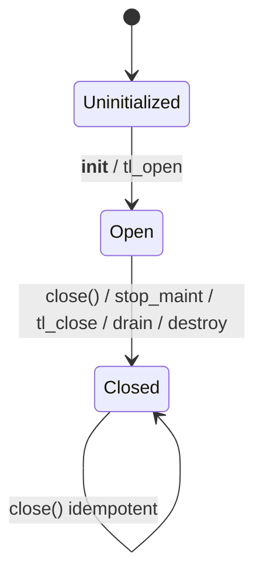

# LLD‑B2: PyTimelog Engine Wrapper (CPython binding layer / Part 2)

Version: 0.2 (expanded + cross‑verified)  
Last updated: 2026-01-12

This LLD specifies the **PyTimelog** CPython extension type: the runtime adapter that wraps a `tl_timelog_t*` engine instance and exposes a stable, low-overhead Python API surface for writes, deletes, and maintenance. It is designed to align with **LLD‑B1 (Python Object Handle & Lifetime)** and the existing `py_handle.*` + `py_errors.*` modules.

The core design goal is boring correctness: deterministic resource management, explicit ownership, and a clear boundary where the Timelog C engine remains payload-agnostic while the binding layer enforces CPython semantics.

---

## 0. Inputs, assumptions, and alignment points

### 0.1 Inputs used for this LLD

- Prior LLD (PyTimelog wrapper) provided as PDF (this document expands and tightens it).
- Implemented B1 primitives in `py_handle.h/.c`:
  - `tl_py_handle_ctx_init/destroy`
  - `tl_py_on_drop_handle`
  - `tl_py_pins_enter/exit_and_maybe_drain`
  - `tl_py_drain_retired`, `tl_py_retired_queue_len`
- Implemented error translation in `py_errors.h/.c`:
  - `TlPy_InitErrors`, `TlPy_RaiseFromStatus`, `TlPy_RaiseFromStatusFmt`, etc.

### 0.2 Files that are not directly embedded here

Some repo files were not available in the current workspace. This LLD assumes the Timelog V1 public C API continues to expose:

- `tl_open`, `tl_close`
- `tl_append`, `tl_append_batch` (optional)
- `tl_delete_range`, `tl_delete_before`
- `tl_flush`, `tl_compact`
- `tl_maint_start`, `tl_maint_stop` (if background maintenance exists)
- `tl_config_init_defaults`

If any names differ, adapt the wrapper to the current `timelog.h` and keep the invariants unchanged.

---

## 1. Scope and non-goals

### 1.1 Scope (what PyTimelog owns)

PyTimelog owns:

- CPython **type layout** (C struct) and lifetime of `tl_timelog_t*`
- Config parsing / translation: Python kwargs → `tl_config_t`
- Safe lifecycle: `__init__` → `tl_open`; `close/__dealloc__` → stop maintenance → `tl_close` → drain → destroy ctx
- Write path plumbing: `append`, `extend` (batch strategy), `delete_range`, `delete_before`
- Maintenance entrypoints: `flush`, `compact`, `start_maintenance`, `stop_maintenance`
- Backpressure policy around `TL_EBUSY`
- Consistent error translation via `py_errors.*`
- Keeping LLD‑B1 invariants intact (refcounts, deferred decref, quiescent draining)

### 1.2 Non-goals

- Snapshot objects and iterators (LLD‑B3)
- PageSpan / buffer protocol (LLD‑B4)
- Python-facing ergonomic API layer (Layer C)
- Build/packaging and wheel work (LLD‑8)
- Persistency and WAL (explicitly out of scope for V1)

---

## 2. Core invariants (must hold after implementation)

The wrapper MUST enforce:

**W1. One engine-owned INCREF per successful insert.**  
Each successful append stores a handle that represents one strong reference owned by the engine. On failure, the binding rolls back that INCREF.

**W2. No Python C-API in engine drop callbacks.**  
`on_drop_handle` is allowed on non-Python threads; therefore it must not call Python. In V1 we enqueue and later drain under the GIL.

**W3. No DECREF while snapshots/iterators are pinned.**  
Decref only at a quiescent point (`pins == 0`) or force-drain during close after verifying no pins exist.

**W4. No engine calls after close.**  
All public methods check `closed` and raise deterministically.

**W5. Close is deterministic and idempotent.**  
Calling `close()` multiple times is safe; first call closes, subsequent calls are no-ops.

**W6. Method entrypoints never hold engine locks while calling Python.**  
All calls that can execute user code (`Py_DECREF`, creating Python exceptions/objects) occur with no Timelog locks held. (This is structurally ensured by calling Python only in the binding thread and by keeping drop callbacks Python-free.)

---

## 3. Type layout and module-level design

### 3.1 PyTimelog structure

PyTimelog is a heap type with this canonical layout:

```c
typedef struct {
    PyObject_HEAD

    tl_timelog_t* tl;              // NULL if not opened or already closed
    int closed;                    // 0 open, 1 closed

    // Python-object mode: handle/lifetime subsystem context.
    tl_py_handle_ctx_t handle_ctx; // embedded; avoids allocation for ctx

    // Optional: store parsed configuration knobs for introspection/debug.
    tl_time_unit_t time_unit;
    tl_maint_mode_t maint_mode;

    // Backpressure policy (see §7).
    uint8_t busy_policy;           // enum: RAISE / AUTO_FLUSH / AUTO_MAINT

} PyTimelog;
```

Notes:

- **Embed** `tl_py_handle_ctx_t` rather than malloc it: simpler shutdown sequencing and fewer failure points.
- Keep `tl` pointer NULL after close to harden accidental use.
- Expose only stable, minimal state needed for fast checks.

### 3.2 Type slots

Minimum slots:

- `tp_new = PyType_GenericNew`
- `tp_init = PyTimelog_init` (calls open)
- `tp_dealloc = PyTimelog_dealloc` (calls close defensively)
- `tp_methods` defines the method table:
  - `append`, `extend`
  - `delete_range`, `delete_before`
  - `flush`, `compact`
  - `start_maintenance`, `stop_maintenance`
  - `close`, `__enter__`, `__exit__` (optional; can also be in Layer C)

Design choice: implement `close()` in C and optionally a context manager (`__enter__/__exit__`) for deterministic release.

---

## 4. Configuration translation (Python kwargs → tl_config_t)

### 4.1 Parsing strategy

Use `PyArg_ParseTupleAndKeywords` in `tp_init`. Initialize all optional C variables to defaults before parsing, as required by the C-API argument parsing rules.

Supported kwargs (V1 minimal set):

- `time_unit`: str in {"s","ms","us","ns"} or small int enum
- `maintenance`: str in {"disabled","background"} (or bool `background=True`)
- `memtable_max_bytes`: int
- `target_page_bytes`: int
- `sealed_max_runs`: int (optional)
- `drain_batch_limit`: int (controls B1 drain chunk size, default 0 == drain all)
- `busy_policy`: str in {"raise","auto_flush"} (default "raise")

Everything else remains engine defaults via `tl_config_init_defaults`.

### 4.2 Mapping rules

Pseudo:

```c
tl_config_t cfg;
tl_config_init_defaults(&cfg);

cfg.time_unit = map_time_unit(time_unit);
cfg.maintenance_mode = map_maint(maintenance);

// numeric overrides (validate > 0 and within size_t range)
cfg.memtable_max_bytes = (size_t)memtable_max_bytes;
cfg.target_page_bytes  = (size_t)target_page_bytes;
cfg.sealed_max_runs    = (size_t)sealed_max_runs;

// Install drop callback for Python-object mode.
cfg.on_drop_handle = tl_py_on_drop_handle;
cfg.on_drop_ctx    = &self->handle_ctx;
```

Validation:

- timestamps are `int64`; configs that overflow `size_t` or are negative → `ValueError`.
- unknown strings → `ValueError`.
- if `maintenance="background"` but the engine was compiled without maintenance support, fail fast with a clear `RuntimeError`.

### 4.3 Busy policy mapping

Store `busy_policy` in PyTimelog; do **not** put it in `tl_config_t` unless the core supports it.

---

## 5. Lifecycle: open, close, dealloc

### 5.1 `__init__` / tp_init

Algorithm:

1. If `self->tl != NULL`, treat as re-init attempt → error (TypeError).
2. Initialize handle ctx: `tl_py_handle_ctx_init(&self->handle_ctx, drain_batch_limit)`.
3. Build `tl_config_t cfg` from kwargs, install drop callback as above.
4. Call `tl_open(&cfg, &self->tl)`.
5. On failure:
   - destroy handle ctx (safe even if no drops happened)
   - set `self->tl = NULL; self->closed = 1;`
   - raise Python exception via `TlPy_RaiseFromStatus(...)`
6. On success:
   - `self->closed = 0;`
   - store any config fields for introspection if desired
   - optionally auto-start maintenance if `maintenance="background"` AND user asked for it

### 5.2 `close()` (explicit method)

Close MUST be deterministic and safe even if partially initialized.

Order:

1. If `self->closed`, return `None`.
2. Mark closed early: `self->closed = 1` (prevents reentrancy from user finalizers later).
3. If `self->tl == NULL`: only destroy ctx and return.
4. Stop maintenance: call `tl_maint_stop(self->tl)` (if supported). Release GIL around the join.
5. Enforce no pinned snapshots/iterators:
   - if `tl_py_pins_count(&self->handle_ctx) != 0`: raise `RuntimeError` (or TimelogError) and **do not** proceed to `tl_close`. Keep engine open in this case (because closing with active snapshots violates engine preconditions).
6. Call `tl_close(self->tl)` (release GIL around it if it can be slow).
7. Set `self->tl = NULL`.
8. Drain retired objects under the GIL:
   - `tl_py_drain_retired(&self->handle_ctx, /*force=*/1);`
9. Destroy handle ctx: `tl_py_handle_ctx_destroy(&self->handle_ctx)`.
10. Return `None`.

Rationale:

- Stopping maintenance before close eliminates concurrent on-drop pushes while tearing down.
- Refusing close with active pins avoids UAF and matches the engine’s “snapshots must be released” rule.
- Force drain is safe only after pins are confirmed zero.

### 5.3 `tp_dealloc`

`tp_dealloc` must never raise. It should attempt best-effort close:

- If `pins != 0`, do not attempt `tl_close`; leave a debug log / warning (or in debug builds, `assert`).
- Otherwise call `close()` logic.
- Finally call `Py_TYPE(self)->tp_free(self)`.

---

## 6. Public methods (C binding API)

All methods start with:

```c
if (self->closed || self->tl == NULL) {
    return TlPy_RaiseFromStatusFmt(TL_ESTATE, "Timelog is closed");
}
```

### 6.1 `append(ts, obj)`

Signature (Python):

```python
Timelog.append(ts: int, obj: object) -> None
```

Algorithm:

1. Validate `ts` is a Python int; convert to `int64_t` with overflow checking.
2. `Py_INCREF(obj)` (engine-owned ref).
3. `tl_handle_t h = (tl_handle_t)(uintptr_t)obj;`
4. `st = tl_append(self->tl, ts, h);`
5. If `st != TL_OK`:
   - `Py_DECREF(obj)` rollback
   - raise via `TlPy_RaiseFromStatus(st)`
6. Opportunistic drain: `tl_py_drain_retired(&self->handle_ctx, 0);` (safe no-op if pins>0).
7. Return `None`.

### 6.2 `extend(iterable)` (batch)

V1 policy: **safe correctness over maximal throughput**.

Implement extend as a loop over `append` semantics so rollback is exact and you never over-delete preexisting data at the same timestamp.

Signature:

```python
Timelog.extend(items: Iterable[tuple[int, object]]) -> None
```

Algorithm:

- Iterate items; for each `(ts, obj)` call the same append logic.
- If any insert fails:
  - stop immediately and raise
  - all prior successful inserts remain (non-atomic batch). This is explicitly documented.
  - Alternative: add an optional `atomic=True` later when the engine provides all-or-nothing batch or returns an inserted-count.

Rationale:

- Without engine support for “inserted count” or atomic batch semantics, trying to tombstone rollback safely can delete preexisting records sharing timestamps. That’s worse than non-atomic semantics for most users.
- If you later need an atomic mode, design it as:
  - pre-validate and build an in-memory buffer of records
  - call `tl_append_batch` only if it is guaranteed atomic or returns a precise count
  - if not, do not pretend it is atomic

### 6.3 `delete_range(t1, t2)`

Signature:

```python
Timelog.delete_range(t1: int, t2: int) -> None
```

Algorithm:

- Convert both to int64.
- Validate `t1 < t2` for non-empty; allow empty range as no-op.
- Call `tl_delete_range(self->tl, t1, t2)`.
- Raise via `TlPy_RaiseFromStatus` if error.
- Opportunistic drain (safe).
- Return `None`.

### 6.4 `delete_before(cutoff)`

Signature:

```python
Timelog.delete_before(cutoff: int) -> None
```

Algorithm:

- Convert cutoff to int64.
- Call `tl_delete_before(self->tl, cutoff)`.
- Raise on error.
- Return `None`.

### 6.5 `flush()`

Signature:

```python
Timelog.flush() -> None
```

Algorithm:

- Release the GIL for the core call:

```c
Py_BEGIN_ALLOW_THREADS
st = tl_flush(self->tl);
Py_END_ALLOW_THREADS
```

- Raise on error.
- Opportunistic drain under the GIL: `tl_py_drain_retired(&ctx, 0);`
- Return `None`.

Important: no Python API calls while GIL is released. Safe because drop callbacks do not touch Python.

### 6.6 `compact()`

If `tl_compact` is just a “signal” (cheap), you may keep the GIL. If it does real work, release the GIL similarly to `flush()`.

Return `None` or raise.

### 6.7 `start_maintenance()`, `stop_maintenance()`

- `start_maintenance` should validate that config maintenance mode is background; otherwise raise.
- `stop_maintenance` is always safe; release the GIL if it can join.

These methods should not drain (maintenance thread may still be producing retire nodes). Drain opportunistically after stop (since no new callbacks will enqueue after stop returns).

---

## 7. Backpressure policy (TL_EBUSY)

Expose a predictable policy.

### 7.1 Default: raise

Default behavior on `TL_EBUSY`:

- rollback any `INCREF`
- raise `TimelogError` (or specialized Busy error later)

This keeps the wrapper deterministic and avoids surprising long pauses inside `append`.

### 7.2 Optional: auto-flush-on-busy

If `busy_policy == AUTO_FLUSH`:

- on `TL_EBUSY` from `append`, attempt:
  1. `tl_flush()` (GIL released)
  2. retry `tl_append()` once
- If still busy, raise.

Important: the `Py_INCREF` must be done once; do not double-inc.

Pseudo:

```c
Py_INCREF(obj);
h = encode(obj);
st = tl_append(...);
if (st == TL_EBUSY && self->busy_policy == AUTO_FLUSH) {
    Py_BEGIN_ALLOW_THREADS; tl_flush(...); Py_END_ALLOW_THREADS;
    st = tl_append(...);
}
if (st != TL_OK) { Py_DECREF(obj); raise; }
```

---

## 8. Error translation and module init patterns

### 8.1 Use py_errors utilities

All errors should funnel through:

- `TlPy_RaiseFromStatus(st, "...")` or `TlPy_RaiseFromStatusFmt(...)`

This ensures one error vocabulary across all binding modules.

### 8.2 Module init: check PyModule_AddObject return value

`PyModule_AddObject()` only steals a reference on success; on failure you must DECREF manually. Keep this discipline in module init and when exporting exception objects.

---

## 9. Concurrency, GIL, and reentrancy hazards

### 9.1 GIL release boundaries

Safe to release the GIL around pure engine work if:

- the engine call does not invoke Python
- our drop callbacks do not invoke Python (true in B1)
- the binding does not touch Python objects while GIL is released

Therefore, `flush`, `compact` (if heavy), and `stop_maintenance` are the primary candidates.

Do **not** release the GIL inside `append` or `delete_*` in V1: those should remain predictable and small.

### 9.2 Reentrancy from Py_DECREF

When draining retired objects, `Py_DECREF` can run arbitrary Python code via finalizers. That code might call back into the same Timelog object.

Mitigation (V1 minimal):

- mark `self->closed = 1` before starting `close()` work
- in close, refuse public methods once closed
- avoid draining while holding any binding-internal locks

Optional (V1.1): add `in_close` / `in_drain` guards that raise “busy” if reentered.

---

## 10. Mermaid diagrams

### 10.1 Wrapper lifecycle



### 10.2 Append with backpressure policy

```mermaid
flowchart TD
    A[append(ts,obj)] --> B[Py_INCREF(obj)]
    B --> C[encode handle]
    C --> D[tl_append]
    D -->|OK| E[maybe drain retired]
    E --> F[return None]
    D -->|EBUSY & auto_flush| G[tl_flush]
    G --> H[retry tl_append]
    H -->|OK| E
    D -->|error| I[Py_DECREF rollback]
    H -->|error| I
    I --> J[raise mapped exception]
```

---

## 11. Testing requirements (B2-level)

Minimum tests:

1. `append` success increments engine-owned refs and does not leak on teardown.
2. `append` failure rolls back INCREF (fault injection or invalid ts).
3. `close` refuses when pins > 0 (create a fake pinned snapshot via B3 helper or direct pins_enter in tests).
4. `flush` releases GIL (smoke test: run flush in a thread and ensure other Python threads can run).
5. `TL_EBUSY` policy behaves as configured (if you implement auto-flush).

---

## 12. Open questions to resolve before coding

1. Should `extend()` be explicitly documented as non-atomic (recommended for V1)? If users demand atomic batches, we’ll need engine support (inserted-count or atomic batch contract).
2. Should background maintenance auto-start when configured, or require explicit `start_maintenance()`? V1 recommendation: explicit start for predictability.
3. Should we add a `drain()` method for advanced users (useful when pins==0 but you want to force cleanup without closing)?

---

## References (authoritative snippets used to tighten this LLD)

```text
Python C API: Module Objects (PyModule_AddObject reference stealing semantics)
Python C API: Parsing arguments and building values (PyArg_ParseTupleAndKeywords optional defaults)
Python C API: Initialization, Finalization, and Threads (thread attachment / API usage constraints)
PEP 788: Protecting the C API from Interpreter Finalization (background thread C-API considerations)
```

(References are included as descriptions to keep this LLD self-contained; the implementation should link to the specific docs in the repo documentation.)
