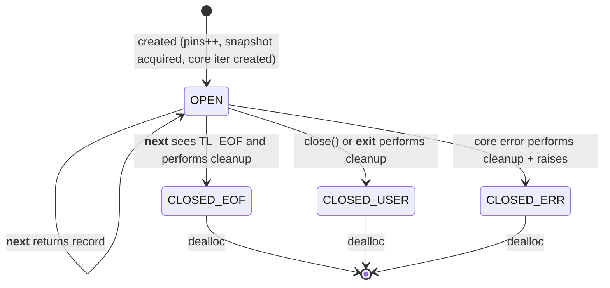

# LLD-B3: PyTimelogIter — Snapshot-Based Iterator Binding (Phase 3)

Status: design-ready (implementation driver)

## 1. Purpose

This document specifies the CPython extension type **PyTimelogIter**: a snapshot-backed iterator that exposes Timelog’s time-range read path to Python in a safe, deterministic, and performant way.

In Timelog’s Python-object mode, the C core stores `(ts:int64, handle:uint64)` pairs, where `handle` is an encoded `PyObject*`. The iterator binding is the “runtime adapter” that:

- acquires a **consistent** engine snapshot,
- constructs a core iterator for a range query,
- iterates records via `tl_iter_next`,
- yields Python results (by default `(ts:int, obj:object)`),
- upholds **refcount**, **GIL**, and **snapshot safety** invariants, and
- releases all core resources deterministically on exhaustion, explicit close, or GC.

The iterator is intentionally small. It must not replicate or reinterpret Timelog’s storage model; it must only translate core iterator semantics into idiomatic Python iteration.

## 2. Context and prerequisites

### 2.1 Core contracts relied on

From Timelog V1 C core (Layer A):

- Reads are snapshot-based and thread-safe: `tl_snapshot_acquire` captures a stable manifest + memview view.
- Iterators are derived from a snapshot and must be destroyed before releasing the snapshot.
- `tl_iter_next(it, &rec)` returns:
  - `TL_OK` and fills `rec` when a record is available,
  - `TL_EOF` when exhausted,
  - other errors for invalid state/args/internal errors.

### 2.2 Python-object mode contracts relied on

From Layer B, Part 1 (handle + lifetime subsystem):

- Append performs `Py_INCREF(obj)` before inserting `handle=encode(obj)` into the engine.
- Physical drop triggers `on_drop_handle(ctx, ts, handle)` on an arbitrary thread, which must **not** touch Python C-API; it pushes the object pointer onto a lock-free retired queue.
- Retired objects are decref’d only during **drain**, under the GIL, and only when `pins == 0` (no active snapshots/iterators).
- Snapshot/iterator creation increments `pins` before acquiring a snapshot; snapshot/iterator destruction decrements `pins` (and may trigger drain).

PyTimelogIter is one of the main producers/consumers of pin transitions and is therefore a correctness-critical integration point.

## 3. Goals and non-goals

Goals:

- Correctness: no UAF, no double-destroy, no refcount leaks, and no Python C-API calls without GIL.
- Snapshot isolation: iteration results reflect a point-in-time view even with concurrent appends/deletes/flush/compaction.
- Deterministic release: iteration resources are released on EOF, `close()`, context manager exit, and `tp_dealloc`.
- Performance: low per-record overhead; optional batching (`next_batch`) to amortize Python call overhead.

Non-goals (Phase 3):

- Zero-copy timestamp spans (`PageSpan`) and buffer protocol (Phase 4).
- Vectorized analytics over payloads.
- Stable ordering across equal timestamps (ties remain unspecified).
- Releasing the GIL during `__next__` (too granular; would add overhead and complicate refcount safety).

## 4. Python-facing API surface

### 4.1 Iterator constructors on PyTimelog

PyTimelog (engine wrapper) exposes methods that return a PyTimelogIter instance:

- `range(t1, t2)` yields records in `[t1, t2)`.
- `since(t1)` yields `[t1, +∞)`.
- `until(t2)` yields `[-∞, t2)` (implemented as `[TL_TS_MIN, t2)` in core).
- `all()` yields all records (implemented as `since(TL_TS_MIN)`).
- (Optional in Phase 3) `equal(ts)` and/or `point(ts)` for exact timestamp queries.

These methods:

1) validate arguments and closed state,
2) acquire a snapshot (with pins protocol),
3) create a core iterator,
4) return a Python iterator object that owns these resources.

### 4.2 What the iterator yields

Default yield: a 2-tuple `(ts: int, obj: object)`.

Rationale: it mirrors common Python patterns (`dict.items()`) and preserves the “time-indexed multimap” contract. Users who only need objects can ignore the timestamp.

### 4.3 Iterator protocol and auxiliary methods

PyTimelogIter implements:

- `__iter__() -> self`
- `__next__() -> (ts, obj)` (implemented via `tp_iternext`)
- `close() -> None` (idempotent, deterministic cleanup)
- `__enter__() -> self`
- `__exit__(exc_type, exc_val, exc_tb) -> False` (calls `close()`, does not suppress exceptions)
- Optional: `next_batch(n: int) -> list[tuple[int, object]]` (see §9)

Closed/exhausted semantics:

- Exhaustion: subsequent `__next__` continues to end the iteration (StopIteration).
- Explicit close: defined as “terminal”; recommended behavior is also StopIteration on `__next__` (consistent with an exhausted iterator). A separate `.closed` boolean property may be exposed for introspection.

## 5. Extension type design

### 5.1 Data structure: PyTimelogIter

The iterator object binds together three lifetimes:

- **owner**: a strong reference to `PyTimelog` to prevent the engine from closing while the iterator exists
- **snapshot**: `tl_snapshot_t*` (core pinned view)
- **iter**: `tl_iter_t*` (core cursor)

Proposed structure:

```c
typedef struct {
    PyObject_HEAD

    /* Strong reference to keep engine alive. */
    PyObject* owner;              /* (PyTimelog*) */

    /* Core resources (valid only when !closed). */
    tl_snapshot_t* snapshot;      /* acquired snapshot */
    tl_iter_t*     iter;          /* core iterator derived from snapshot */

    /* Handle lifetime context (borrowed; owner keeps it alive). */
    tl_py_handle_ctx_t* handle_ctx;

    /* State flags. */
    uint8_t closed;               /* 0=open, 1=closed/exhausted */
} PyTimelogIter;
```

Design notes:

- `handle_ctx` is stored explicitly so cleanup does not need to dereference `owner` after reentrancy-safe field clearing.
- `closed` is set early during cleanup to make the object robust against reentrancy (finalizers triggered during drain).

### 5.2 GC participation (recommended)

Even if today there is no direct Python-level cycle, future revisions may add:
- owner-side tracking of iterators, or
- iterator-side caching of Python objects.

To avoid future cyclic GC issues, implement GC support now:

- allocate with `PyObject_GC_New`,
- implement `tp_traverse` to visit `owner`,
- implement `tp_clear` to clear `owner`,
- in `tp_dealloc`, call `PyObject_GC_UnTrack`, `tp_clear`, then free.

If you prefer minimal overhead in Phase 3, GC support can be deferred; but adding it later is usually harder than implementing it early.

## 6. State machine

Iterator states are driven by resource ownership.



Invariant: **in CLOSED\_*** states, `iter == NULL` and `snapshot == NULL`, and the pin has been released exactly once.

## 7. Core algorithms

### 7.1 Iterator creation (range/since/until/all)

This logic lives in PyTimelog methods, but is specified here because it defines PyTimelogIter’s resource invariants.

Creation steps (common skeleton):

1) Validate engine open and argument ranges.
2) `tl_py_pins_enter(handle_ctx)` **before** snapshot acquire.
3) `tl_snapshot_acquire(self->tl, &snap)`. On error: rollback pin and raise.
4) Create core iterator from snapshot:
   - `tl_iter_range(snap, t1, t2, &it)` or variants.
   On error: destroy snapshot, rollback pin, raise.
5) Allocate PyTimelogIter:
   - `obj = PyObject_GC_New(PyTimelogIter, &PyTimelogIter_Type)`
   - `obj->owner = Py_NewRef((PyObject*)self)` (strong ref)
   - `obj->snapshot = snap; obj->iter = it; obj->handle_ctx = self->handle_ctx; obj->closed = 0;`
   - track for GC if enabled.
6) Return iterator object.

Reentrancy and failure safety:

- Any failure after `pins_enter` must ensure *exactly one* corresponding `pins_exit_and_maybe_drain`.
- Any failure after `tl_snapshot_acquire` must ensure `tl_snapshot_release`.
- Any failure after core iterator creation must ensure `tl_iter_destroy` then `tl_snapshot_release`.

Pseudocode (creation helper):

```c
static PyObject* pytimelog_make_iter(PyTimelog* self,
                                    enum mode m,
                                    tl_ts_t t1, tl_ts_t t2)
{
    if (self->closed) return raise_closed();

    tl_py_handle_ctx_t* ctx = self->handle_ctx;
    tl_py_pins_enter(ctx);

    tl_snapshot_t* snap = NULL;
    tl_status_t st = tl_snapshot_acquire(self->tl, &snap);
    if (st != TL_OK) {
        tl_py_pins_exit_and_maybe_drain(ctx);
        return TlPy_RaiseFromStatus(st);
    }

    tl_iter_t* it = NULL;
    st = core_make_iter(m, snap, t1, t2, &it);
    if (st != TL_OK) {
        tl_snapshot_release(snap);
        tl_py_pins_exit_and_maybe_drain(ctx);
        return TlPy_RaiseFromStatus(st);
    }

    PyTimelogIter* pyit = PyObject_GC_New(PyTimelogIter, &PyTimelogIter_Type);
    if (!pyit) {
        tl_iter_destroy(it);
        tl_snapshot_release(snap);
        tl_py_pins_exit_and_maybe_drain(ctx);
        return PyErr_NoMemory();
    }

    pyit->owner = Py_NewRef((PyObject*)self);
    pyit->snapshot = snap;
    pyit->iter = it;
    pyit->handle_ctx = ctx;
    pyit->closed = 0;

    PyObject_GC_Track(pyit);
    return (PyObject*)pyit;
}
```

### 7.2 Iteration step: tp_iternext

Rules:

- Must hold the GIL (it will, because CPython calls tp_iternext under the GIL).
- Must produce **new references** for yielded objects.
- Must treat `TL_EOF` as normal termination and free resources eagerly.
- Must treat errors as exceptional, free resources, and raise.

Algorithm:

1) If `closed`: end iteration (StopIteration).
2) Call `tl_iter_next(self->iter, &rec)`.
3) If `TL_OK`:
   - `obj = tl_py_handle_decode(rec.handle)` (borrowed pointer)
   - `obj = Py_NewRef(obj)` (user-owned reference)
   - `ts_obj = PyLong_FromLongLong(rec.ts)`
   - `pair = PyTuple_New(2); set items`
   - return pair
4) If `TL_EOF`:
   - cleanup resources (see §7.3)
   - return NULL with no exception (StopIteration)
5) Else (error):
   - cleanup resources
   - raise mapped exception

Pseudocode:

```c
static PyObject* PyTimelogIter_iternext(PyTimelogIter* self)
{
    if (self->closed) {
        /* End-of-iteration: return NULL with no exception. */
        return NULL;
    }

    tl_record_t rec;
    tl_status_t st = tl_iter_next(self->iter, &rec);

    if (st == TL_OK) {
        PyObject* obj = tl_py_handle_decode(rec.handle); /* borrowed */
        PyObject* obj_ref = Py_NewRef(obj);              /* new ref */

        PyObject* ts = PyLong_FromLongLong((long long)rec.ts);
        if (!ts) { Py_DECREF(obj_ref); return NULL; }

        PyObject* tup = PyTuple_New(2);
        if (!tup) { Py_DECREF(ts); Py_DECREF(obj_ref); return NULL; }

        PyTuple_SET_ITEM(tup, 0, ts);       /* steals */
        PyTuple_SET_ITEM(tup, 1, obj_ref);  /* steals */
        return tup;
    }

    if (st == TL_EOF) {
        pytimelog_iter_cleanup(self);
        return NULL; /* StopIteration */
    }

    pytimelog_iter_cleanup(self);
    TlPy_RaiseFromStatus(st);
    return NULL;
}
```

Note: In CPython, returning `NULL` from `tp_iternext` with no exception is a valid and slightly faster way to signal StopIteration. The binding may choose to set StopIteration explicitly, but it is not required.

### 7.3 Cleanup routine (single source of truth)

All cleanup paths (EOF, error, explicit close, dealloc) must funnel through one idempotent routine.

Key properties:

- Idempotent: safe on double close or dealloc-after-close.
- Reentrancy-safe: set `closed=1` and clear pointers before running code that may execute Python-level finalizers (drain).

Required ordering:

1) destroy core iterator
2) release snapshot
3) exit pin (may drain retired objects)
4) release owner ref

Pseudocode:

```c
static void pytimelog_iter_cleanup(PyTimelogIter* self)
{
    if (self->closed) return;
    self->closed = 1;

    tl_iter_t* it = self->iter;           self->iter = NULL;
    tl_snapshot_t* snap = self->snapshot; self->snapshot = NULL;
    tl_py_handle_ctx_t* ctx = self->handle_ctx; /* borrowed */

    PyObject* owner = self->owner;        self->owner = NULL;

    if (it)   tl_iter_destroy(it);
    if (snap) tl_snapshot_release(snap);

    if (ctx)  tl_py_pins_exit_and_maybe_drain(ctx);

    Py_XDECREF(owner);
}
```

Drain behavior:

- `tl_py_pins_exit_and_maybe_drain` may call `Py_DECREF` on a batch of retired objects.
- `Py_DECREF` may execute arbitrary Python code (`__del__`, weakref callbacks).
- Hence the “clear first, then drain” ordering.

### 7.4 Explicit close() method

`close()` calls the cleanup routine and returns `None`. It is idempotent.

Semantics choice:

- After explicit `close()`, `__next__` behaves like an exhausted iterator (StopIteration). This is the simplest and most “iterator-like” behavior.

Pseudocode:

```c
static PyObject* PyTimelogIter_close(PyTimelogIter* self, PyObject* noargs)
{
    pytimelog_iter_cleanup(self);
    Py_RETURN_NONE;
}
```

### 7.5 Context manager support

- `__enter__` returns `self` (new ref).
- `__exit__` calls `close()` and returns `False` to propagate exceptions.

```c
static PyObject* PyTimelogIter_enter(PyTimelogIter* self, PyObject* noargs)
{
    return Py_NewRef((PyObject*)self);
}

static PyObject* PyTimelogIter_exit(PyTimelogIter* self, PyObject* args)
{
    pytimelog_iter_cleanup(self);
    Py_RETURN_FALSE;  /* do not suppress */
}
```

### 7.6 tp_dealloc

`tp_dealloc` is the final safety net. It must cleanup if still open.

If GC-enabled:

- `PyObject_GC_UnTrack(self)`
- `pytimelog_iter_cleanup(self)`
- `Py_TYPE(self)->tp_free((PyObject*)self)`

If GC not enabled:

- directly call cleanup then `tp_free`.

Important: avoid calling `pytimelog_iter_cleanup` twice if dealloc follows close; cleanup is idempotent.

## 8. Concurrency and thread rules

### 8.1 GIL rules

The Python C API requires the GIL for all refcount operations, object creation, and exception handling. Therefore:

- PyTimelogIter methods must assume they are called with the GIL (true for Python calls into the extension).
- Do not release the GIL in `tp_iternext`: each step creates Python objects and touches refcounts.

### 8.2 Interactions with background maintenance

Compaction may drop records and enqueue Python objects onto the retired queue. While any iterator/snapshot exists (`pins > 0`), the queue is not drained, guaranteeing that objects are not freed while still potentially visible to an active snapshot.

When the iterator releases its pin, if it was the last pin, a drain may occur immediately in the same thread (under the GIL).

### 8.3 Close semantics relative to owner

The iterator owns a strong reference to the owner (PyTimelog), preventing `tl_close` from being reached via owner GC while iterators exist. This avoids “owner freed while iterator still needs the handle context” failure modes.

Owner-initiated `close()` should refuse to close while pins > 0 (already a Phase 2 invariant). Therefore, the iterator cleanup path does not need to handle “engine already closed” as a normal case.

## 9. Optional performance feature: next_batch(n)

### 9.1 Semantics

`next_batch(n)` returns a list of up to `n` records (each record is `(ts, obj)`).

- If the iterator has fewer than `n` remaining items, it returns the remaining items and closes the iterator.
- If the iterator is already exhausted/closed, it returns an empty list.
- Errors during fetch raise immediately and close the iterator.

This follows a “file.read” style convention: empty list means EOF.

### 9.2 Implementation approach

A safe, efficient implementation:

- validate `n` is a positive Python int
- allocate list capacity `n` (`PyList_New(n)`)
- fill sequentially with `PyList_SET_ITEM`
- on early EOF, shrink tail using `PyList_SetSlice(list, filled, n, NULL)`
- on error, decref the list and raise

Pseudocode:

```c
static PyObject* PyTimelogIter_next_batch(PyTimelogIter* self, PyObject* arg_n)
{
    Py_ssize_t n = PyLong_AsSsize_t(arg_n);
    if (n < 0 && PyErr_Occurred()) return NULL;
    if (n <= 0) return PyList_New(0);

    if (self->closed) return PyList_New(0);

    PyObject* list = PyList_New(n);
    if (!list) return NULL;

    Py_ssize_t i = 0;
    for (; i < n; i++) {
        tl_record_t rec;
        tl_status_t st = tl_iter_next(self->iter, &rec);

        if (st == TL_OK) {
            PyObject* obj = Py_NewRef(tl_py_handle_decode(rec.handle));
            PyObject* ts  = PyLong_FromLongLong((long long)rec.ts);
            PyObject* tup = NULL;

            if (!obj || !ts) { Py_XDECREF(obj); Py_XDECREF(ts); goto fail; }

            tup = PyTuple_New(2);
            if (!tup) { Py_DECREF(obj); Py_DECREF(ts); goto fail; }

            PyTuple_SET_ITEM(tup, 0, ts);
            PyTuple_SET_ITEM(tup, 1, obj);

            PyList_SET_ITEM(list, i, tup); /* steals tup */
            continue;
        }

        if (st == TL_EOF) {
            pytimelog_iter_cleanup(self);
            break;
        }

        /* error */
        pytimelog_iter_cleanup(self);
        TlPy_RaiseFromStatus(st);
        goto fail;
    }

    /* shrink if early EOF */
    if (i < n) {
        if (PyList_SetSlice(list, i, n, NULL) < 0) goto fail;
    }
    return list;

fail:
    Py_DECREF(list);
    return NULL;
}
```

### 9.3 Future optimization: two-phase batch with reduced GIL hold time

A possible later improvement:

1) release GIL and pull up to `n` `(ts, handle)` pairs into a temporary C array,
2) reacquire GIL and build Python objects.

This reduces the amount of time the GIL is held for IO-like scanning, but increases complexity and requires careful pin/lifetime handling. Not recommended for Phase 3.

## 10. Error handling and exception mapping

Use the project’s centralized mapping (Phase 1/2 `py_errors`), e.g.:

- `TL_EINVAL` → `ValueError`
- `TL_ESTATE` → `TimelogClosedError` / `TimelogError` (project-defined)
- `TL_ENOMEM` → `MemoryError`
- `TL_EOVERFLOW` → `OverflowError`
- `TL_EINTERNAL` → `SystemError` or `TimelogError`

Error-path invariants:

- Always release iterator + snapshot + pin if they were acquired.
- Never leave pins incremented on a failing constructor.
- Never partially return a tuple/list containing a borrowed ref; every returned object must be a new ref.

## 11. Testing requirements (Phase 3)

The test plan must validate both correctness and the pin/drain integration.

Coverage targets:

1) Basic range iteration: insert known objects; iterate `[t1, t2)`; verify yielded tuples and ordering guarantees (non-decreasing timestamps; duplicates preserved).
2) Exhaustion cleanup: exhaust iterator; ensure pins drop to 0; ensure Timelog can be closed after.
3) Explicit close: iterate a few items, call `close()`, ensure pins drop; subsequent iteration ends (StopIteration) and does not crash.
4) Context manager: `with tl.range(...) as it:` then break early; ensure iterator is closed after block and pins drop.
5) Multiple iterators: open two iterators; ensure pins reflect 2; close one; pins reflect 1; close both; pins 0.
6) Deletion/compaction interaction: acquire iterator (pins>0), delete/compact in another thread or sequence, ensure snapshot still yields expected records; after iterator closes, ensure retired objects are drained.
7) next_batch: verify returns correct list sizes, correct contents, correct EOF behavior, and correct cleanup on errors.
8) GC dealloc: create iterator and drop references without exhausting/closing; force GC; ensure pins drop and no leaks.

For deep refcount tests, use custom Python objects with visible `__del__` side-effects to detect premature frees or leaks.

## 12. Module/code organization (recommended)

Add a dedicated binding unit for iterators:

- `bindings/cpython/include/timelogpy/py_iter.h`
- `bindings/cpython/src/py_iter.c`
- tests:
  - either `bindings/cpython/tests/test_py_iter.c` or extension of existing binding tests.

Module init (`module.c`) should call `PyType_Ready(&PyTimelogIter_Type)` and register it (optionally public as `_timelog.TimelogIter`).

## 13. References

Primary (CPython docs):

- Defining extension types and iterator protocol: https://docs.python.org/3/extending/newtypes.html
- Type object slots (`tp_iter`, `tp_iternext`, dealloc, GC): https://docs.python.org/3/c-api/typeobj.html
- Reference counting rules: https://docs.python.org/3/c-api/refcounting.html
- GIL and threads in C extensions: https://docs.python.org/3/c-api/init.html
- Exception handling in C extensions: https://docs.python.org/3/c-api/exceptions.html
