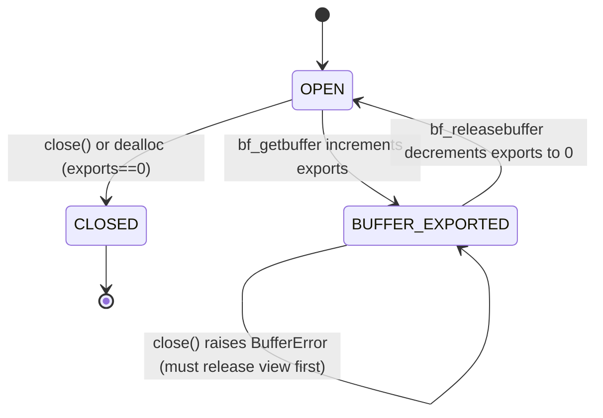

# LLD-B4: PageSpan and Zero-Copy Timestamp Spans

Status: design-ready (implementation driver)
Last revised: 2026-01-15 (Section 5.2: documented __exit__ silent behavior; Section 7.1: added alloc field; Section 7.5: fixed destruction order - free before DECREF to avoid allocator UAF; Section 9.3: ndim unconditionally 1 per CPython docs)

This document specifies Phase 4 of the Timelog Python integration: **zero-copy exposure of timestamps** (and optionally handles) via a **PageSpan** abstraction and the CPython **buffer protocol**.

The core promise is simple: **reading timestamps must not copy data by default**. Copies happen only when the user explicitly asks for them (e.g., `.copy()`, `.tolist()`, `bytes(...)`, `array(...)`, `np.array(..., copy=True)`).

---

## 1. Problem statement and motivation

The Phase 3 iterator (`PyTimelogIter`) is correct and idiomatic: it yields `(ts:int, obj:object)` tuples. But it is fundamentally *per-record* and therefore CPU-heavy for many workloads:

- each `ts` becomes a Python `int` object,
- each `__next__` crosses the C/Python boundary,
- and even if the user only wants timestamps, they still pay per-record overhead.

Yet the core engine already stores timestamps densely inside pages, in sorted contiguous memory. The right performance move is to let Python access those timestamp arrays **directly**, as a read-only view, without copying.

PageSpan makes this possible without pretending that an arbitrary range is one contiguous array: it exposes only **physically contiguous spans** (a slice of a single page).

---

## 2. Design goals

PageSpan must provide these invariants:

1. **Zero-copy timestamps**: `.timestamps` is a read-only `memoryview` backed by core page memory.
2. **Lifetime safety**: exported buffers must remain valid until all consumers release them.
3. **Snapshot safety**: spans are tied to a snapshot (and the Python pin protocol), so background compaction cannot free underlying memory while a span/buffer exists.
4. **Explicit copy only**: any operation that materializes a Python list/array is explicit (`copy()`, `tolist()`, etc.).
5. **Composable API**: spans are produced by factory methods on `Timelog`, and can be used to implement higher-level slicing later.

---

## 3. Non-goals

- Providing a single contiguous view for the entire `[t1, t2)` range (not physically possible without copying).
- Zero-copy exposure of Python objects (payloads are references; you can avoid copying *payload bytes* but you cannot avoid Python reference semantics).
- Replacing the logical iterator semantics (tombstones/overlaps). PageSpan is a **physical view** primitive. Higher-level code can decide how to combine it with logical semantics.

---

## 4. Concepts and mental model

A **page** is the unit of contiguity: timestamps live in a dense `tl_ts_t[]` (and handles in a parallel `tl_handle_t[]`). A query range intersects multiple pages. PageSpan yields a sequence of **page slices**:

```
range [t1, t2)  =>  [pageA rows i..j) , [pageB rows k..m) , ...
```

Each span is independently contiguous; the full range is a concatenation of spans.

This is intentionally aligned with cache lines and CPU prefetching: the binding provides a mechanism to process timestamps in bulk, in a way that maps to the engine's physical layout.

---

## 5. Public API surface

### 5.1 Timelog factory methods

`Timelog.page_spans(t1: int, t2: int, *, kind: str = "segment") -> PageSpanIter`

- Returns an iterator of `PageSpan` objects covering records in `[t1, t2)`.
- Each yielded span is a contiguous slice of timestamps (and handles) from one page.

`kind` is a policy knob:

- `"segment"` (Phase 4 baseline): spans come only from immutable segment pages (L1 then L0, in manifest order). Tombstone-only segments are skipped.
- `"all"` (future): include memtable/memrun sources once a safe strided/SoA view exists (current memruns are AoS `tl_record_t[]`, so zero-copy spans are not available).
- `"merged"` (future): attempt to emit spans in global time order from a merged stream when safe to do so without copying.

This LLD specifies `"segment"` in detail (baseline). The future knobs are included to keep API stable as optimization grows.

### 5.2 PageSpan interface

A `PageSpan` instance represents one page slice.

Properties:

- `timestamps: memoryview`  
  Read-only, 1-D view of `tl_ts_t` values (int64) for this span.
- `handles: memoryview` (optional)  
  Read-only, 1-D view of `tl_handle_t` values (uint64) aligned with `timestamps`.
  Note: the buffer protocol exposes a single region per exporter; if handles are exposed,
  use a separate exporter object (e.g., `PageSpanHandles`) that shares the same lifetime.
- `start_ts: int`, `end_ts: int`  
  First and last timestamps in this span (both inclusive).
- `__len__() -> int`

Methods:

- `objects() -> PageSpanObjectsView`  
  Returns a **lazy** Python sequence-like view over decoded payloads. No list is allocated.
- `copy_timestamps() -> list[int]`, `copy_handles() -> list[int]` (optional), `copy() -> tuple[list[int], list[int]]`  
  Explicit copying entry points (see Section 11). If handles are not supported in B4, omit `copy_handles()` and have `copy()` return only timestamps.

Lifecycle:

- `close() -> None`
  Releases this span's reference to the shared snapshot owner. **Raises `BufferError`** if buffers are exported.
- `__enter__/__exit__` (context manager) for deterministic release.
  - `__enter__` returns self.
  - `__exit__` calls cleanup if no buffers are exported; **silently returns `False`** (does not raise)
    if buffers are still exported. This follows Python convention where `__exit__` should not raise
    for cleanup issues unrelated to the propagating exception. Users who need strict error checking
    should call `close()` explicitly, which does raise `BufferError`.

### 5.3 Internal header access requirements

**Important architectural note**: Unlike B2/B3 which use only the public API (`timelog/timelog.h`),
B4 requires access to internal headers for direct page/segment memory access:

| Header | Purpose |
|--------|---------|
| `src/storage/tl_page.h` | `tl_page_t` structure with `ts[]`, `h[]` arrays |
| `src/storage/tl_segment.h` | `tl_segment_t` structure and page catalog |
| `src/storage/tl_manifest.h` | `tl_manifest_t` for L1/L0 segment arrays |
| `src/query/tl_snapshot.h` | `tl_snapshot_t` to access manifest |

This is intentional: zero-copy requires direct pointer access to page memory, which cannot
be abstracted behind a public API without defeating the purpose.

The Python binding code (`py_span.c`, `py_span_iter.c`) will include these internal headers.
This creates a tighter coupling to core internals than B2/B3, but is necessary for the
zero-copy guarantee.

**Future consideration**: If internal structures change significantly, B4 code must be
updated accordingly. The page SoA layout (`ts[]`, `h[]` as separate arrays) is stable
and unlikely to change.

---

## 6. Architecture and lifetimes

### 6.1 Key objects

We introduce two new extension types:

- `PyPageSpan` (exporter of timestamp buffer)
- `PyPageSpanIter` (iterator yielding spans)

We also introduce one internal shared owner (C-only, not exposed to Python):

- `tl_py_span_owner_t` (refcounted owner of snapshot + one pin; holds a strong ref to `PyTimelog`)

In addition, we introduce one *Python-level* view object (implemented in C for speed and refcount safety):

- `PyPageSpanObjectsView` (sequence/iterator over handles decoded to `PyObject*` lazily)

### 6.2 Lifetime chain

The safety model is:

`memoryview` -> holds ref to `PageSpan` (exporter)  
`PageSpan` -> holds ref to `span_owner` (refcounted; owns snapshot + one pin)  
`span_owner` -> holds ref to `PyTimelog` (keeps handle_ctx + engine alive)  
snapshot -> prevents core memory reclamation  
handle subsystem -> prevents decref of payloads until pins drop to 0

This ensures that as long as *any* exported memoryview exists, page memory is valid.

### 6.3 State machine



Key invariant: **you cannot close a PageSpan while its buffer is exported**.

---

## 7. Data structures

### 7.1 Shared snapshot owner (internal)

The core snapshot type (`tl_snapshot_t`) is single-owner (no refcount). To share
one snapshot across multiple spans, we introduce a small refcounted C-only owner
that both the iterator and spans reference.

```c
typedef struct tl_py_span_owner {
    uint32_t refcnt;             /* GIL-protected refcount */
    PyObject* timelog;           /* PyTimelog* strong ref */
    tl_snapshot_t* snapshot;     /* Owned snapshot */
    tl_py_handle_ctx_t* handle_ctx; /* Borrowed from timelog */
    tl_alloc_ctx_t* alloc;       /* Allocator (borrowed from timelog via snapshot) */
} tl_py_span_owner_t;
```

Notes:

- `refcnt` is updated under the GIL (no atomics required).
- Owner creation calls `tl_py_pins_enter`; owner destruction calls
  `tl_py_pins_exit_and_maybe_drain` and `tl_snapshot_release`.

### 7.2 PyPageSpan

```c
typedef struct {
    PyObject_HEAD

    /* Shared snapshot owner (refcounted). */
    tl_py_span_owner_t* owner;       /* NULL if closed */
    const tl_page_t* page;           /* NULL if closed */

    /* Slice boundaries within page arrays. */
    size_t row_start;                /* inclusive */
    size_t row_end;                  /* exclusive */

    /* Buffer protocol shape/strides (stable while span lives). */
    Py_ssize_t shape[1];
    Py_ssize_t strides[1];

    /* Buffer protocol bookkeeping. */
    uint32_t exports;                /* number of active exported buffers */

    /* State */
    uint8_t closed;                  /* 0=open, 1=closed */
} PyPageSpan;
```

Notes:

- `exports` is necessary only to forbid `close()` while a buffer is live. It also makes debug assertions easier.
- `page` is a borrowed pointer into snapshot-owned memory. The shared owner keeps the snapshot pinned.

### 7.3 PyPageSpanIter

This iterates over a precomputed list of span descriptors (page pointer + row bounds).

```c
typedef struct {
    PyObject_HEAD

    tl_py_span_owner_t* owner;       /* shared snapshot owner */

    span_desc_t* spans;              /* C array allocated once */
    size_t count;
    size_t index;

    uint8_t closed;
} PyPageSpanIter;
```

`span_desc_t`:

```c
typedef struct {
    const tl_page_t* page;
    size_t row_start;
    size_t row_end;
} span_desc_t;
```

### 7.4 PyPageSpanObjectsView

This is the no-copy payload access companion:

- It behaves like a Python sequence: supports `len()`, indexing, and iteration.
- It does not allocate a list of objects unless `.copy()` is called.
- It decodes handles lazily and returns `Py_NewRef(obj)` for each element.

```c
typedef struct {
    PyObject_HEAD
    PyObject* span;                  /* strong ref to PyPageSpan */
} PyPageSpanObjectsView;
```

### 7.5 Owner destruction and cleanup order

When the shared owner's refcount reaches zero, resources must be released in this exact order:

```c
static void span_owner_destroy(tl_py_span_owner_t* owner)
{
    if (!owner) return;

    /* Move pointers to locals BEFORE Python code (reentrancy safety) */
    tl_snapshot_t* snap = owner->snapshot;
    owner->snapshot = NULL;

    tl_py_handle_ctx_t* ctx = owner->handle_ctx;
    owner->handle_ctx = NULL;

    PyObject* timelog = owner->timelog;
    owner->timelog = NULL;

    tl_alloc_ctx_t* alloc = owner->alloc;
    owner->alloc = NULL;

    /*
     * Release order (critical):
     * 1. Release snapshot (no Python code)
     * 2. Free owner struct (MUST happen before DECREF - see note below)
     * 3. Exit pins and maybe drain (may run Py_DECREF via drain)
     * 4. DECREF timelog owner (may run Python code)
     *
     * IMPORTANT: The allocator is borrowed from the timelog. If we DECREF
     * the timelog before calling tl__free(), the timelog might be destroyed,
     * invalidating the allocator and causing use-after-free. Therefore we
     * MUST free the owner struct before any operation that might destroy
     * the timelog.
     */
    if (snap) {
        tl_snapshot_release(snap);
    }

    /* Free owner BEFORE decref'ing timelog (allocator is borrowed from timelog) */
    tl__free(alloc, owner);

    /*
     * Preserve exception state across operations that may run arbitrary Python
     * code (drain, timelog DECREF). This ensures:
     * - Clean iteration path stays clean
     * - __exit__ path doesn't corrupt the propagating exception
     * - Bad finalizers in __del__ don't clobber our exception state
     */
    PyObject *exc_type, *exc_value, *exc_tb;
    PyErr_Fetch(&exc_type, &exc_value, &exc_tb);

    if (ctx) {
        tl_py_pins_exit_and_maybe_drain(ctx);
    }

    Py_XDECREF(timelog);

    PyErr_Restore(exc_type, exc_value, exc_tb);
}
```

**Key points:**

1. Clear pointers BEFORE operations that may run Python code (reentrancy safety)
2. Release snapshot before exiting pins (snapshot must be valid during pin period)
3. Exception state preservation around drain/DECREF (matches B3 pattern)
4. This is the ONLY place that calls `tl_py_pins_exit_and_maybe_drain` for spans

### 7.6 Page access pattern via segment catalog

Iterating pages within a segment requires understanding the catalog structure:

```c
/*
 * Access pattern for collecting spans from a segment:
 *
 * tl_segment_t contains:
 *   - catalog: page_entry_t array with page pointers and metadata
 *   - n_pages: number of pages in catalog
 *
 * Each page_entry_t contains:
 *   - page: pointer to tl_page_t
 *   - Additional catalog metadata for binary search
 *
 * tl_page_t contains (SoA layout):
 *   - ts[]: timestamp array (tl_ts_t = int64_t)
 *   - h[]:  handle array (tl_handle_t = uint64_t)
 *   - count: number of records
 *   - min_ts, max_ts: range metadata
 */

/* Example: iterate all pages in a segment */
for (uint32_t i = 0; i < seg->n_pages; i++) {
    const tl_page_t* page = seg->catalog[i].page;

    /* Page arrays are directly accessible */
    const tl_ts_t*     ts_array = page->ts;      /* timestamps */
    const tl_handle_t* h_array  = page->h;       /* handles */
    const uint32_t     count    = page->count;   /* array length */

    /* For zero-copy exposure, we point memoryview at ts_array + offset */
}

/* Manifest access for L1/L0 segments */
const tl_manifest_t* manifest = snap->manifest;

/* L1 segments: non-overlapping, sorted by window_start */
for (uint32_t i = 0; i < manifest->n_l1; i++) {
    tl_segment_t* seg = manifest->l1[i];
    /* process segment pages */
}

/* L0 segments: may overlap, in flush order */
for (uint32_t i = 0; i < manifest->n_l0; i++) {
    tl_segment_t* seg = manifest->l0[i];
    /* process segment pages */
}
```

**Note**: The exact field names may vary slightly (e.g., `catalog` vs `pages`).
Consult `src/storage/tl_segment.h` for the authoritative structure definition.

---

## 8. Algorithms

### 8.1 Collecting spans for `[t1, t2)` from immutable segments

Baseline algorithm: build a list of page slices that overlap the range.

For each segment in snapshot (L1 then L0, in manifest order):

1) skip tombstone-only segments (`seg->page_count == 0` or `tl_segment_is_tombstone_only`)  
2) prune by segment min/max timestamp metadata (`tl_range_overlaps`)  
3) find candidate pages via the page catalog:
   - `page_idx = tl_page_catalog_find_first_ge(cat, t1)`
   - `page_end = tl_page_catalog_find_start_ge(cat, t2)`
4) for each candidate page:
   - skip `TL_PAGE_FULLY_DELETED` pages
   - `row_start = tl_page_lower_bound(page, t1)`
   - `row_end   = tl_page_lower_bound(page, t2)`
   - if `row_start < row_end`, emit `span_desc{page, row_start, row_end}`

Note: V1 emits only `TL_PAGE_FULLY_LIVE` pages. If `TL_PAGE_PARTIAL_DELETED` is
introduced later, spans must either be split around deleted rows or fall back to
record iteration for correctness.

This creates one span per page slice. It is O(S log P + K log R) where:

- S = number of segments
- P = pages per segment
- K = number of candidate pages overlapping the range
- R = rows per page (binary searches inside a page)

The important part is that it is metadata-driven and avoids scanning irrelevant pages.

### 8.2 Ordering policy

For `"segment"` kind, spans are produced in manifest order: all L1 segments
(sorted by window_start), then L0 segments in flush order. Each span is internally
sorted by timestamp, but the overall stream is not globally merged.

This does not claim global merged ordering across overlapping components. If the user requires logical merge ordering, they should use `range()` (Phase 3) or a future `"merged"` spans mode.

This keeps Phase 4 internally consistent, simple, and safe.

---

## 9. CPython buffer protocol integration

### 9.1 Why buffer protocol (instead of copying)

The CPython buffer protocol is the standardized way for an object to expose an internal memory region to consumers (including `memoryview`, `array`, NumPy, file IO). It is designed exactly to share memory without copying.

PageSpan is the exporter. Consumers obtain a `memoryview` of timestamps. That memoryview points directly to `page->ts + row_start`.

### 9.2 Exporter contract

The exporter must satisfy:

- `bf_getbuffer(exporter, view, flags)` fills `Py_buffer` with pointers/shape/strides and sets `view->obj` to a **new reference** to an object that keeps the memory alive.
- Every successful `bf_getbuffer` is paired with exactly one `bf_releasebuffer`.
- The exporter must not free or invalidate the memory region until all exports are released.

This is why `PageSpan.close()` must be forbidden while `exports > 0`.

### 9.3 Implementation strategy

We implement `tp_as_buffer` on `PyPageSpan_Type`.

#### bf_getbuffer

- reject if closed
- reject writable requests
- compute pointer and length:
  - `base = (void*)(page->ts + row_start)`
  - `len_bytes = (row_end - row_start) * sizeof(tl_ts_t)`
- fill view:
  - `readonly = 1`
  - `itemsize = sizeof(tl_ts_t)`
  - `format = "q"` if requested
  - `ndim = 1`
  - `shape[0] = count`
  - `strides[0] = sizeof(tl_ts_t)`
- set `view->obj = Py_NewRef(exporter)` (or ensure PyBuffer_FillInfo does it correctly)
- increment `exports`

Pseudo-C:

```c
/*
 * Format string must be static (survives function return).
 * "q" = signed 64-bit integer (int64_t / tl_ts_t)
 */
static const char* PAGESPAN_TS_FORMAT = "q";

static int pagespan_getbuffer(PyObject* exporter, Py_buffer* view, int flags) {
    PyPageSpan* self = (PyPageSpan*)exporter;

    if (self->closed) {
        PyErr_SetString(PyExc_ValueError, "PageSpan is closed");
        return -1;
    }
    if ((flags & PyBUF_WRITABLE) == PyBUF_WRITABLE) {
        PyErr_SetString(PyExc_BufferError, "PageSpan buffer is read-only");
        return -1;
    }

    const Py_ssize_t n = (Py_ssize_t)(self->row_end - self->row_start);
    void* ptr = (void*)(self->page->ts + self->row_start);
    Py_ssize_t len = n * (Py_ssize_t)sizeof(tl_ts_t);

    /*
     * Initialize view manually instead of PyBuffer_FillInfo.
     * This gives us full control over format/shape/strides handling.
     *
     * PyBuffer_FillInfo is designed for simple byte buffers and doesn't
     * handle typed arrays well (it sets format=NULL, itemsize=1).
     */
    view->obj = Py_NewRef(exporter);
    view->buf = ptr;
    view->len = len;
    view->readonly = 1;
    view->itemsize = (Py_ssize_t)sizeof(tl_ts_t);

    /*
     * Format handling per PEP 3118:
     * - PyBUF_FORMAT: caller wants format string
     * - Without PyBUF_FORMAT: set format to NULL (caller doesn't care)
     */
    if (flags & PyBUF_FORMAT) {
        view->format = (char*)PAGESPAN_TS_FORMAT;  /* cast away const for API */
    } else {
        view->format = NULL;
    }

    /*
     * Dimensionality handling:
     *
     * IMPORTANT: Per CPython buffer protocol documentation, ndim is a
     * "request-independent" field that must ALWAYS be filled with the
     * correct value reflecting the actual dimensionality of the data.
     * For our 1D timestamp array, ndim is unconditionally 1.
     *
     * Only shape and strides POINTERS are request-dependent:
     * - PyBUF_ND: caller wants shape pointer
     * - PyBUF_STRIDES: caller wants strides pointer (implies PyBUF_ND)
     * - Without these flags: set shape=NULL, strides=NULL
     *
     * Reference: https://docs.python.org/3/c-api/buffer.html
     * "The following fields are not influenced by flags and must always
     *  be filled in with the correct values: obj, buf, len, itemsize, ndim."
     */
    view->ndim = 1;  /* ALWAYS 1 - request-independent per CPython docs */

    if (flags & PyBUF_ND) {
        self->shape[0] = n;
        view->shape = self->shape;
    } else {
        view->shape = NULL;
    }

    if (flags & PyBUF_STRIDES) {
        self->strides[0] = (Py_ssize_t)sizeof(tl_ts_t);
        view->strides = self->strides;
    } else {
        view->strides = NULL;
    }

    view->suboffsets = NULL;
    view->internal = NULL;

    self->exports++;
    return 0;
}
```

**Key implementation notes:**

1. **Static format string**: The format string must point to static storage that outlives
   the buffer view. Never use a stack-allocated string.

2. **Manual initialization**: We avoid `PyBuffer_FillInfo` because it's designed for simple
   byte buffers and sets `itemsize=1`, `format=NULL`. For typed arrays, manual initialization
   is cleaner.

3. **Flag handling**: PEP 3118 specifies which fields to fill based on flags. Callers that
   don't request `PyBUF_FORMAT` or `PyBUF_ND` may not handle those fields correctly.

If a handles view is implemented, use a separate exporter object with:

- `base = (void*)(page->h + row_start)`
- `len_bytes = (row_end - row_start) * sizeof(tl_handle_t)`
- `format = "Q"` (uint64_t) when `PyBUF_FORMAT` is requested

#### bf_releasebuffer

```c
static void pagespan_releasebuffer(PyObject* exporter, Py_buffer* view) {
    PyPageSpan* self = (PyPageSpan*)exporter;
    TL_ASSERT(self->exports > 0);
    self->exports--;
}
```

### 9.4 How `.timestamps` returns a memoryview without copying

Two valid patterns:

1) If PageSpan exports buffer:  
   `.timestamps` returns `PyMemoryView_FromObject((PyObject*)self)`.

2) If PageSpan does not export buffer (not recommended here):  
   `.timestamps` would allocate a `Py_buffer` and call `PyMemoryView_FromBuffer`, which is easier to misuse.

We choose pattern (1): PageSpan is the exporter, and `memoryview` is the canonical consumer object.

### 9.5 Buffer lifetime and `.close()`

Rule:

- If `exports > 0`, `close()` raises `BufferError("cannot close PageSpan: buffer is exported")`.

This is the cleanest semantic for correctness and makes lifetime constraints explicit to Python callers.

---

## 10. Snapshot pinning and handle lifetime integration

### 10.1 Pin/unpin rules

On shared owner creation (inside `page_spans()`):

- `tl_py_pins_enter(handle_ctx)` (pin)

On shared owner final release:

- `tl_py_pins_exit_and_maybe_drain(handle_ctx)` (unpin, may drain retired objects)

This is identical to the iterator pin protocol from Phase 3; PageSpan is simply another reader that must keep the epoch pinned while it can observe old pages and old object references.

### 10.2 Why the owner ref is mandatory

The handle context and the timelog engine live inside `PyTimelog`. The shared
owner must hold a strong reference to `PyTimelog` so:

- the handle context memory is valid,
- the engine cannot be closed while the span exists,
- and close-time checks (`pins == 0`) remain meaningful.

---

## 11. Copy policy and explicit materialization

The no-copy principle is enforced by API design.

### 11.1 No-copy operations

- Accessing `.timestamps` yields a memoryview: no copy.
- Accessing `.handles` yields a memoryview if implemented via a separate exporter (otherwise omit in B4).
- `objects()` returns a lazy view: no list allocation, no copying payload bytes.

### 11.2 Explicit copy operations

We provide a small number of explicit copying entry points:

- `PageSpan.timestamps_copy()` -> `list[int]` (uses `memoryview.tolist()` internally)
- `PageSpan.handles_copy()` -> `list[int]` (optional)
- `PageSpan.objects().copy()` -> `list[object]`
- `PageSpan.copy()` -> `tuple[list[int], list[int]]` (explicit materialization; if handles are omitted, return timestamps only)

Additionally, users can always do:

- `bytes(span.timestamps)` or `span.timestamps.tobytes()` (copies)
- `span.timestamps.tolist()` (copies element-wise)
- `array('q', span.timestamps)` (copies)

The important thing is that PageSpan itself never copies unless explicitly requested.

---

## 12. Error handling

- `page_spans(t1, t2)`:
  - validates `t1`/`t2` are ints and timelog is open.
  - if `t1 >= t2`, returns an empty iterator (matches `tl_iter_range`).
  - if no spans exist, returns an empty iterator (recommended Python behavior), not an exception.
    - Returning empty iterator composes better with `for` loops and mirrors Python containers.
    - If you want an exception policy, make it explicit as `strict=True` (not default).

- `PageSpan` operations on closed spans raise `ValueError`.

- `close()` while exported buffers exist raises `BufferError`.

---

## 13. Testing plan (Phase 4)

Tests must validate:

1) Correctness of timestamp values:
   - spans cover the raw page timestamps that overlap `[t1, t2)` for the chosen source kind (no tombstone filtering; duplicates/overlaps possible across L0/L1).
   - within each span, timestamps are non-decreasing.

2) Buffer semantics:
   - `mv = span.timestamps` is read-only (assignment fails).
   - buffer length equals `(len(span) * 8)`.
   - memoryview remains valid as long as it is referenced.
   - `span.close()` while `mv` exists raises `BufferError`.

3) Lifetime / pin invariants:
   - while any span exists, `Timelog.close()` fails with busy/pins error.
   - once spans are dropped/closed, `Timelog.close()` succeeds.
   - no pin underflow/overflow in stress loops.

4) Object view semantics:
   - `objs = span.objects()` supports iteration and indexing.
   - objects returned are safe references (`Py_NewRef`), no UAF under compaction.

5) Sanitizer runs:
   - ASan/UBSan should show no use-after-free for memoryview scenarios.

---

## 14. Code layout

Recommended C binding files:

- `bindings/cpython/include/timelogpy/py_span.h`
- `bindings/cpython/src/py_span.c`
- `bindings/cpython/include/timelogpy/py_span_iter.h`
- `bindings/cpython/src/py_span_iter.c`
- `bindings/cpython/include/timelogpy/py_span_objects.h`
- `bindings/cpython/src/py_span_objects.c`
- tests:
  - `bindings/cpython/tests/test_py_span.c`

Module init:

- `PyType_Ready(&PyPageSpan_Type)`
- `PyType_Ready(&PyPageSpanIter_Type)`
- `PyType_Ready(&PyPageSpanObjectsView_Type)`
- register them in `timelog._timelog`.

---

## 15. Future extensions (without breaking the API)

Phase 4 deliberately introduces a narrow primitive. Two natural expansions later:

1) `"merged"` span mode: emit spans in global time order using merge-iterator chunking, but only when the next output chunk comes from a contiguous slice of one source.
2) Buffer exposure for handles (uint64) and maybe offsets into a sidecar, enabling further zero-copy patterns.

These can be added without changing the PageSpan core invariants.

---

## 16. Summary

PageSpan is the zero-copy read primitive for Timelog in Python:

- It converts dense page storage into Python-visible `memoryview` without copying.
- It ties buffer lifetime to snapshot pins and to the Timelog instance.
- It makes copying explicit and optional.
- It stays honest about contiguity: spans are per-page slices.

This provides the foundation for fast slicing and range operations that scale in Python without turning every scan into per-record allocation work.
