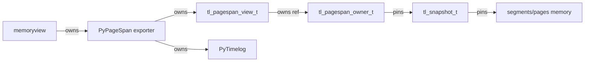

# LLD-V2-SpanCore: Core PageSpan Enumeration API (Zero-Copy without Binding Duplication)

This document defines a core-level PageSpan enumeration API that removes the current duplication where bindings re-implement internal page/segment scan logic. The API makes page spans a first-class concept in the C core so bindings only wrap stable span descriptors and expose them (e.g., as `memoryview`) without copying.

Scope of this LLD is core API + contracts and how bindings consume it. It does not prescribe a specific segment/page internal layout; instead it defines the minimal invariants that must remain stable for zero-copy spans to work. The initial implementation must preserve current B4 behavior and tests; no additional behavior beyond B4 is required.

---

## 0) Inputs used (strict)

Sources used to align with the current codebase:

- `bindings/cpython/src/py_span.c`
- `bindings/cpython/src/py_span_iter.c`
- `bindings/cpython/src/py_span_objects.c`
- `bindings/cpython/src/py_timelog.c`
- `bindings/cpython/src/module.c`
- `src/query/tl_segment_iter.c`
- `src/query/tl_snapshot.c`
- `src/storage/tl_page.c`
- `src/storage/tl_segment.c`
- `src/storage/tl_page.h`
- `src/storage/tl_segment.h`
- `include/timelog/timelog.h`
- `src/tl_timelog.c`

References:
- CPython buffer protocol docs (see References section)

---

## 1) Problem statement (first principles)

### 1.1 Why the current approach is fragile

The binding-side PageSpan implementation enumerates pages by traversing snapshot -> manifest -> segments -> catalogs -> pages and applying the same boundary logic as core iterators (catalog searches + `tl_page_lower_bound`). This duplicates algorithmic logic that already exists in the core (e.g., `tl_segment_iter_init` uses catalog find functions and `tl_page_lower_bound` to find per-page bounds).

Duplication creates two failure modes:

1) Algorithm drift: core scan logic evolves (page catalog semantics change), but bindings stay stale, returning wrong results or crashing.
2) Layout coupling: bindings read internal fields (`tl_segment_t`, `tl_page_catalog_t`, `tl_page_t`), so any internal refactor becomes a binding refactor.

Zero-copy spans must be coupled to physical layout (they point to real memory), but algorithm duplication is not required. We can centralize enumeration and the physical contract in core and expose only stable span descriptors + accessors.

### 1.2 What "zero-copy" means here

For B4, the key requirement is:
- The default read path must allow a consumer to obtain a view over contiguous `int64` timestamps without copying.

In CPython, that means: an exporter implements the buffer protocol and returns a `memoryview` that points directly at core memory. This is what `py_span.c` already does. The remaining risk is: how do we safely and correctly find which contiguous slices to export? That is the portion currently duplicated in `py_span_iter.c` and must move into core.

---

## 2) Design goals

1) Single source of truth: page span discovery lives in the core.
2) Opaque abstraction: bindings do not depend on core struct layouts.
3) Stable lifetime model: spans remain valid until the last user releases them.
4) Zero-copy by default: timestamps are exposed as views, not copied.
5) Compatible with snapshot isolation.
6) Extensible for V2 storage changes without breaking bindings.
7) Preserve B4 behavior and tests without extra scope.

---

## 3) Core API: public shapes and contracts

This API is intended as an internal-but-stable contract for bindings (not necessarily a public end-user API in `timelog.h`). It matches current B4 semantics.

### 3.1 Types

```c
/* Opaque owner that pins the resources backing spans. */
typedef struct tl_pagespan_owner tl_pagespan_owner_t;

/* Opaque iterator over spans for a time range. */
typedef struct tl_pagespan_iter  tl_pagespan_iter_t;

/* A stable span view that bindings can hold and export. */
typedef struct tl_pagespan_view {
    tl_pagespan_owner_t* owner;    /* owned ref (see ownership rules) */

    const tl_ts_t*       ts;       /* pointer to contiguous ts array */
    const tl_handle_t*   h;        /* pointer to contiguous handle array */
    uint32_t             len;      /* number of rows in this span (must be > 0) */

    /* Optional metadata (helps bindings, helps debugging). */
    tl_ts_t              first_ts; /* equals ts[0] */
    tl_ts_t              last_ts;  /* equals ts[len-1] */
} tl_pagespan_view_t;
```

Notes:
- `len` is always > 0 for returned spans. Zero-length spans are never emitted.
- `first_ts/last_ts` are valid because `len > 0`.
- `h` is required in V1/B4 because `PyPageSpanObjectsView` depends on handles. If handles are unavailable in future storage, the core must return `TL_EINVAL` for flags that require handles.
- This is an internal contract; if a public ABI is required later, add explicit version/size fields.

### 3.2 Ownership rules

- `tl_pagespan_owner_t` is reference-counted.
- Each call to `tl_pagespan_iter_next()` that returns `TL_OK` yields a view whose `owner` is an owned reference (refcount already incremented for the caller).
- The caller must release it via `tl_pagespan_owner_decref(view.owner)` (or helper `tl_pagespan_view_release`).
- `tl_pagespan_iter_close()` releases its own references but does not invalidate previously returned spans, because each returned span carries its own owner ref.

Helper:

```c
static inline void tl_pagespan_view_release(tl_pagespan_view_t* v) {
    if (v && v->owner) {
        tl_pagespan_owner_decref(v->owner);
    }
    if (v) {
        memset(v, 0, sizeof(*v));
    }
}
```

### 3.3 Release hooks (binding integration)

Bindings need to drop pins and run deferred DECREF logic when the last span is released. Core does not know about Python, so an optional release hook is needed.

```c
typedef void (*tl_pagespan_owner_release_fn)(void* user);

typedef struct tl_pagespan_owner_hooks {
    void* user;                            /* opaque to core */
    tl_pagespan_owner_release_fn on_release; /* optional */
} tl_pagespan_owner_hooks_t;
```

Owner destruction order (CRITICAL - order matters for allocator lifetime):
1) Copy out hooks (function pointer + user pointer) from owner struct.
2) Release snapshot/segment refs (no Python code runs here).
3) Free owner struct BEFORE calling hook.
4) Invoke `on_release(user)` if hooks.on_release is non-NULL.

Rationale for free-before-hook: The hook may Py_DECREF the timelog, which owns
the allocator. If the hook runs before freeing the owner, and that DECREF is
the last reference, the allocator could be freed while still in use (UAF).

Constraints on release hook:
- Hook must NOT assume the owner struct exists (it has been freed).
- Hook must NOT call back into pagespan API (re-entrancy forbidden).
- For CPython bindings, the hook must run with the GIL held because it calls
  `tl_py_pins_exit_and_maybe_drain()` and `Py_DECREF`.

### 3.4 Functions

Primary entrypoint (recommended):

```c
tl_status_t tl_pagespan_iter_open(
    tl_timelog_t* tl,                   /* open timelog */
    tl_ts_t t1,
    tl_ts_t t2,                          /* exclusive */
    uint32_t flags,
    const tl_pagespan_owner_hooks_t* hooks, /* optional */
    tl_pagespan_iter_t** out);

tl_status_t tl_pagespan_iter_next(
    tl_pagespan_iter_t* it,
    tl_pagespan_view_t* out_view);       /* filled on TL_OK */

void tl_pagespan_iter_close(tl_pagespan_iter_t* it);
```

Rationale:
- Avoids snapshot ownership ambiguity (core acquires and releases its own snapshot).
- Matches current binding behavior where page spans are created directly from `PyTimelog`.

Optional advanced entrypoint (only if needed later):

```c
/* Consumes the snapshot: the iterator owns and releases it. */
tl_status_t tl_pagespan_iter_open_from_snapshot(
    tl_snapshot_t* snap,
    tl_ts_t t1,
    tl_ts_t t2,
    uint32_t flags,
    const tl_pagespan_owner_hooks_t* hooks,
    tl_pagespan_iter_t** out);
```

### 3.5 Flags and defaults

```c
enum {
    TL_PAGESPAN_SEGMENTS_ONLY    = 1u << 0, /* ignore memview/memtable */
    TL_PAGESPAN_INCLUDE_L0       = 1u << 1, /* include level-0 segments */
    TL_PAGESPAN_INCLUDE_L1       = 1u << 2, /* include level-1 segments */
    TL_PAGESPAN_VISIBLE_ONLY     = 1u << 3, /* reserved (not implemented in B4) */
    TL_PAGESPAN_REQUIRE_ZEROCOPY = 1u << 4, /* must not allocate staging buffers */
};

#define TL_PAGESPAN_DEFAULT \
    (TL_PAGESPAN_SEGMENTS_ONLY | TL_PAGESPAN_INCLUDE_L0 | \
     TL_PAGESPAN_INCLUDE_L1 | TL_PAGESPAN_REQUIRE_ZEROCOPY)
```

Rules:
- If `flags == 0`, treat it as `TL_PAGESPAN_DEFAULT` (recommended call pattern).
- B4 only supports segment-backed spans. If `TL_PAGESPAN_SEGMENTS_ONLY` is not set, return `TL_EINVAL`.
- Flags not supported in the initial implementation (e.g., `VISIBLE_ONLY`) must return `TL_EINVAL` to avoid extra scope beyond B4.

### 3.6 Status codes

Use existing `tl_status_t` codes only:

- `TL_OK`      span produced
- `TL_EOF`     no more spans (also used for empty ranges)
- `TL_EINVAL`  invalid args or unsupported flags
- `TL_ESTATE`  timelog not open or snapshot acquisition failed due to state
- `TL_ENOMEM`  allocation failure
- `TL_EOVERFLOW` arithmetic overflow in bounds calculations
- `TL_EINTERNAL` unexpected internal error

No new status codes are introduced in this LLD.

### 3.7 Range semantics

- `t1` is inclusive, `t2` is exclusive (half-open interval `[t1, t2)`).
- Empty range behavior (`t1 >= t2`):
  - `tl_pagespan_iter_open()` returns `TL_OK` and creates a valid iterator.
  - The first call to `tl_pagespan_iter_next()` returns `TL_EOF`.
  - This follows standard iterator semantics: "open always succeeds if args are
    valid; next returns EOF when exhausted."
  - Matches current B4 binding behavior (see `test_py_span.c:page_spans_empty_range`).
- There is no unbounded sentinel (`TL_TS_MAX` is a valid data timestamp). Unbounded ranges are out of scope for this API in B4; use finite `t2` values only. A future `TL_PAGESPAN_T2_UNBOUNDED` flag can be added if needed.

---

## 4) Core invariants required for correctness

Zero-copy spans cannot be fully storage-agnostic. They require a minimal physical contract:

### 4.1 Memory stability contract (no relocation while owned)

For any span view returned while its owner is alive:

- `view.ts` points to a memory region that remains valid and unchanged for at least `view.len * sizeof(tl_ts_t)` bytes.
- `view.h` (if non-NULL) remains valid and aligned with timestamps.

This contract can be satisfied in different ways:
- V1 style: pages are heap-allocated and pinned by snapshot refs.
- V2 dynamic segments: pages may live in a cache; the owner ref pins the cache entry.
- Compression (future): if zero-copy cannot be provided, return `TL_EINVAL` for `REQUIRE_ZEROCOPY`.

### 4.2 Catalog/search semantics are internal again

Bindings must not call `tl_page_catalog_find_*` or inspect `tl_segment_t` / `tl_page_t`. The core API becomes the only supported way to enumerate spans.

---

## 5) Algorithm design (core implementation)

The core already has correct range logic in `tl_segment_iter_init`:
- page pruning via catalog binary search (`tl_page_catalog_find_first_ge`, `tl_page_catalog_find_start_ge`)
- per-page row bounds via `tl_page_lower_bound`
- min/max overlap checks

The pagespan iterator should reuse the same primitives to avoid duplication inside core. Treat `tl_segment_iter_init` as the canonical reference for range pruning logic and keep them aligned.

### 5.1 Segment cursor for spans

```c
typedef struct {
    const tl_segment_t* seg;
    uint32_t page_idx, page_end;
    tl_ts_t t1, t2;
} tl_segment_span_cursor_t;
```

Initialization is analogous to `tl_segment_iter_init`:
1) Prune segment by overlap (`tl_range_overlaps`).
2) Find first page with `max_ts >= t1`.
3) Find page_end with `min_ts >= t2`.

### 5.2 Iterator flow

The pagespan iterator holds:
- a reference-counted owner (pins snapshot/segments)
- manifest pointer (borrowed from snapshot)
- range and flags
- current phase (L1, then L0)
- per-segment cursor

Pseudo-flow for `next()`:

1) If no active cursor, pick next segment (L1 then L0) and initialize cursor.
2) For the current cursor, scan pages in `[page_idx, page_end)`:
   - validate page flags: if `page->flags != TL_PAGE_FULLY_LIVE`, return `TL_EINTERNAL`
     (V1/B4 only produces FULLY_LIVE pages; other states indicate corruption or a bug)
   - compute `row_start = tl_page_lower_bound(page, t1)`
   - compute `row_end   = tl_page_lower_bound(page, t2)`
   - if `row_start < row_end`, build a `tl_pagespan_view_t` and return `TL_OK`
3) If cursor exhausted, move to next segment.

This is the same logic currently implemented in the binding, centralized in core.

**Note:** The error-out behavior for non-FULLY_LIVE pages is a fail-fast design choice.
If V2 introduces PARTIAL_DELETED pages with row bitmaps, this code path must be
updated to handle visibility splitting instead of erroring out.

### 5.3 Visibility filtering (future hook, not in B4)

If future storage introduces tombstones or partial deletes:
- `TL_PAGESPAN_VISIBLE_ONLY` may split a page into multiple spans (zero-copy still possible).
- If visibility cannot be expressed as contiguous slices, return `TL_EINVAL` when `REQUIRE_ZEROCOPY` is set.

In the initial implementation, `VISIBLE_ONLY` must be rejected with `TL_EINVAL` to keep scope aligned with B4.

---

## 6) Binding integration (CPython)

### 6.1 What stays

Existing B4 behavior remains:
- `PyPageSpan` exports timestamps via the buffer protocol, read-only.
- `bf_getbuffer` fills request-independent fields (`obj, buf, len, itemsize, ndim`) every time.
- `view->obj` is a new ref; close is blocked while buffers are exported.
- `PyPageSpanObjectsView` yields decoded objects lazily.

### 6.2 What changes

**Today:** `py_span_iter.c` enumerates pages by walking `snapshot->manifest` and `seg->catalog`.

**With this LLD:** `py_span_iter.c` becomes a thin wrapper:

- call `tl_pagespan_iter_open(tl, t1, t2, flags, hooks, &it)`
- in `tp_iternext`, call `tl_pagespan_iter_next(it, &view)`
- create `PyPageSpan` by storing `view` (or its pointers + owner)
- when span closes/deallocs, `tl_pagespan_owner_decref(view.owner)`

### 6.3 Binding release hook

The binding supplies a release hook that:
- calls `tl_py_pins_exit_and_maybe_drain(handle_ctx)` with the GIL held
- `Py_DECREF` the owning `PyTimelog`

This preserves the current pin/drain lifecycle without re-implementing core enumeration logic.

---

## 7) Migration plan (minimal disruption)

1) Add core pagespan API in `src/query/tl_pagespan_iter.h/.c`.
2) Implement the iterator using existing catalog and lower_bound helpers.
3) Refactor `py_span_iter.c` to consume the core iterator and remove internal struct access.
4) Keep all B4 tests unchanged and passing.

Note: memview/memtable span enumeration is explicitly out of scope for B4. Only segment-backed spans are supported.

No additional APIs or test changes beyond B4 are required.

---

## 8) Security and correctness notes

### 8.1 C correctness
- Check for overflow when computing buffer lengths (`len * sizeof(tl_ts_t)`).
- Ensure `view.len > 0` and `ts`/`h` pointers are non-NULL for emitted spans.
- Keep internal structs opaque to bindings.
- Refcount concurrency: B4 uses plain `uint32_t` refcount (not atomic). This
  requires ALL incref/decref calls to be serialized by the caller. For CPython,
  the GIL provides this guarantee. Future bindings (Rust, Go) may require
  atomic refcount if spans can be released from multiple threads.
- Page index casts: When casting `size_t` page indices to `uint32_t`, validate
  that the value fits (page counts are bounded by segment construction).

### 8.2 CPython correctness
- On buffer errors, set `view->obj = NULL` before returning `-1`.
- Preserve exception state across cleanup that may call Python code. The release
  hook MUST use `PyErr_Fetch`/`PyErr_Restore` around any calls that might invoke
  Python finalizers (e.g., `Py_DECREF`), because the hook may run during
  GC/unwinding when an exception is already set.
- Ensure all types are `PyType_Ready`-ed in module init.
- `PyPageSpan.close()` must fail or no-op if buffer exports > 0.
- The release hook is ONLY called from GIL-protected code paths. If future
  refactors allow `owner_decref` from background threads, the hook must use
  `PyGILState_Ensure`/`PyGILState_Release`.

---

## 9) Mermaid diagram: lifetime graph



Guarantee:
- As long as any memoryview exists, it keeps the PageSpan alive.
- PageSpan holds a span view with an owned owner ref.
- Owner pins snapshot resources, keeping `ts` memory stable.

---

## 10) References

- CPython buffer protocol docs: https://docs.python.org/3/c-api/buffer.html
- CPython type object / buffer slots: https://docs.python.org/3/c-api/typeobj.html

---

## 11) Files read (traceability)

- `bindings/cpython/src/py_span.c`
- `bindings/cpython/src/py_span_iter.c`
- `bindings/cpython/src/py_span_objects.c`
- `bindings/cpython/src/py_timelog.c`
- `bindings/cpython/src/module.c`
- `src/query/tl_segment_iter.c`
- `src/query/tl_snapshot.c`
- `src/storage/tl_page.c`
- `src/storage/tl_segment.c`
- `src/storage/tl_page.h`
- `src/storage/tl_segment.h`
- `include/timelog/timelog.h`
- `src/tl_timelog.c`
